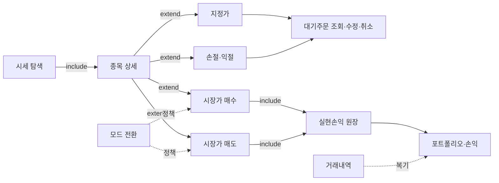

# Trading Simulator — 유즈케이스 명세서 (Use Case Specification)

> **본 문서는 모의투자 시뮬레이션 앱 기획 문서이며 실제 투자자문이 아닙니다.** 본 앱은 가짜 자산으로 매매를 연습하는 교육·엔터테인먼트 목적의 페이퍼 트레이딩 시뮬레이션이며, 실제 자금·실제 체결·투자중개·투자자문을 제공하지 않습니다.

**한줄요약:** 게스트 온보딩·핵심 트레이딩·포트폴리오 회계부터 학습·게임화·소셜(프로필 열람·공개범위·팔로우·다차원 리더보드)·수익화·법무/개인정보·커뮤니티 트러스트&세이프티까지 49개 유즈케이스를 표준 형식(액터·목표·사전조건·흐름·사후조건·관련정책)으로 정리하고, 액터 정의·유즈케이스 다이어그램·우선순위 표를 제공한다.

---

## 목차

1. [문서 개요](#1-문서-개요)
2. [액터 정의(Actors)](#2-액터-정의actors)
3. [유즈케이스 다이어그램](#3-유즈케이스-다이어그램)
4. [유즈케이스 목록 및 ID 체계](#4-유즈케이스-목록-및-id-체계)
5. [그룹 A — 핵심 트레이딩·포트폴리오 상세](#5-그룹-a--핵심-트레이딩포트폴리오-상세)
6. [그룹 B — 온보딩·학습·게임화·소셜·수익화 상세](#6-그룹-b--온보딩학습게임화소셜수익화-상세)
7. [우선순위 표(Priority Matrix)](#7-우선순위-표priority-matrix)
8. [부록 — 정책 참조 색인](#8-부록--정책-참조-색인)

---

## 1. 문서 개요

- **제품:** Trading Simulator — 가짜 자산 모의투자(페이퍼 트레이딩) 모바일 앱 (Expo/React Native + TypeScript, iOS·Android·Web).
- **범위:** 시작자산 $100,000, 12종+ 시뮬 시세(2초 랜덤워크→GBM 재설계 예정), 매수/매도·대기주문, 포트폴리오·손익 회계, 학습·게임화·소셜·수익화·법무·개인정보.
- **성격 전제:** 실제 돈/체결 없음. 투자자문·중개 아님. 면책·규제·앱스토어 정책을 항상 준수.
- **ID 재정렬:** 원자료의 두 그룹이 UC-01 등 ID가 충돌하므로, 본 문서는 그룹 A는 `UC-A##`, 그룹 B는 `UC-B##`로 네임스페이스를 부여한다. 온보딩(UC-A01 ↔ UC-B01)은 동일 사용자 여정의 두 관점이므로 상호 참조한다.
- **연관 문서:** 정책 상세는 하단 [부록 색인](#8-부록--정책-참조-색인) 참조. 도메인 정책은 [account-policy](./account-policy.md), [order-policy](./order-policy.md), [market-policy](./market-policy.md), [portfolio-accounting-policy](./portfolio-accounting-policy.md), [gamification-fairness-policy](./gamification-fairness-policy.md), [monetization-policy](./monetization-policy.md), [legal-compliance-policy](./legal-compliance-policy.md), [data-privacy-security-policy](./data-privacy-security-policy.md) 형태로 상호 참조 예정.

---

## 2. 액터 정의(Actors)

### 2.1 1차(주) 액터 — 사용자 계층

| 액터 | 정의 | 대표 유즈케이스 |
|---|---|---|
| **신규 사용자(게스트)** | 앱 최초 실행, 회원가입 없이 로컬 게스트로 시작. 서버 PII 미전송. | UC-A01, UC-B01, UC-B02 |
| **사용자(일반)** | 게스트·가입 무관하게 솔로 시뮬을 사용하는 계층. 매매·포트폴리오·학습 열람. | UC-A02~A14, UC-B04~B11 |
| **학습자** | 팁 카드·용어사전·시나리오 등 가벼운 콘텐츠를 즐기는 모든 사용자. | UC-B04~B07 |
| **복귀 사용자** | 데일리 미션·스트릭을 이어가는 리텐션 계층. | UC-B08, UC-B09 |
| **경쟁 사용자(가입 필요)** | 리그·리더보드에 참여하는 가입 사용자. | UC-B12, UC-B16, UC-B35 |
| **소셜 사용자(프로필·팔로우)** | 타 유저 프로필을 열람하고 공개범위를 설정하며 팔로우(비대칭 구독)·다차원 리더보드를 사용하는 가입 계층(전체공개 대표 헤더는 게스트도 열람). | UC-B32~B35 |
| **고위험 선호 사용자** | 절대수익·고변동을 추구, 격리 리그로 수용. | UC-B13 |
| **방장(그룹 리더/교사/동아리장)** | 비공개 그룹 대회를 개설·운영. K-factor 엔진. | UC-B14 |
| **초대받은 사용자** | 초대 링크/QR로 대회·친구에 합류(게스트/가입). | UC-B15, UC-B17 |
| **결제 사용자(가입)** | 구독·IAP·무료체험·광고 리워드 결제/수령. | UC-B20~B25 |
| **기존 구독자** | 구독 복원·크로스플랫폼 동기화 대상. | UC-B22 |
| **신고자(모든 사용자)** | 부적절 콘텐츠/사용자를 신고하거나 특정 사용자를 차단하는 계층(게스트 포함). | UC-B29, UC-B30 |
| **모더레이터/운영자** | 어드민 콘솔 RBAC 권한으로 신고 큐를 검토·조치하는 내부 운영 인력. | UC-B31 |

### 2.2 시스템/자동 액터

| 액터 | 정의 | 대표 유즈케이스 |
|---|---|---|
| **시스템(앱)** | 저장·복원·마이그레이션·틱 엔진·대기주문 평가·자동 판정. | UC-A07~A09, UC-A14, UC-B26 |
| **시세 엔진/Provider** | 결정론 시뮬(또는 실데이터 Provider) 시세 생성·팬아웃. | UC-A03, UC-A04 |
| **대기주문 평가 엔진** | 매 틱 순수함수로 대기주문 발동·체결·만료 평가. | UC-A07~A09 |

### 2.3 외부 시스템(서포팅 액터)

| 액터 | 정의 |
|---|---|
| **앱스토어 결제(App Store/Google Play IAP)** | 결제·영수증·환불·구독 갱신의 결제 주체. |
| **엔타이틀먼트 백엔드(RevenueCat 등)** | 영수증 서버검증·크로스플랫폼 권한 동기화. |
| **광고 SDK(AdMob 등)** | 리워드 비디오·배너·SSV 완주 검증. |
| **실데이터 벤더/거래소 API** | 재배포 허가 유료 소스(주식) 및 거래소 WS(크립토). |
| **백엔드 서버** | 대회 결정론 시세·리그 집계·권위 시각·이상탐지·동기화. |
| **인증 제공자(Apple/Google OAuth)** | 지연 가입 인증. |

---

## 3. 유즈케이스 다이어그램

### 3.1 전체 개요(도메인 그룹핑)

```mermaid
graph TB
    subgraph Actors[액터]
        G[신규 사용자·게스트]
        U[사용자]
        L[학습자]
        R[복귀 사용자]
        C[경쟁 사용자]
        S[소셜 사용자]
        H[호스트·방장]
        P[결제 사용자]
        SYS[시스템·엔진]
    end

    subgraph A[그룹 A · 트레이딩·포트폴리오]
        A01[UC-A01 게스트 온보딩 첫 매수]
        A03[UC-A03 시세 탐색]
        A04[UC-A04 종목 상세]
        A05[UC-A05 시장가 매수]
        A06[UC-A06 시장가 매도]
        A07[UC-A07 지정가]
        A08[UC-A08 손절·익절]
        A10[UC-A10 포트폴리오·손익]
        A14[UC-A14 지속·복원]
    end

    subgraph B[그룹 B · 학습·게임화·소셜·수익화]
        B01[UC-B01 온보딩]
        B04[UC-B04 학습 카드]
        B08[UC-B08 데일리 미션]
        B09[UC-B09 스트릭]
        B12[UC-B12 주간 리그]
        B14[UC-B14 그룹 대회 개설]
        B20[UC-B20 구독 결제]
        B25[UC-B25 리워드 광고]
        B27[UC-B27 동의 관리]
        B29[UC-B29 신고]
        B30[UC-B30 차단]
        B31[UC-B31 모더레이션 큐]
        B32[UC-B32 프로필 열람]
        B33[UC-B33 공개범위 설정]
        B34[UC-B34 팔로우]
        B35[UC-B35 다차원 리더보드]
    end

    G --> A01 --> B01
    U --> A03 --> A04 --> A05
    A04 --> A06
    U --> A07 --> A08
    U --> A10
    SYS --> A14
    L --> B04
    R --> B08 --> B09
    C --> B12
    H --> B14
    P --> B20
    U --> B25
    U --> B27
    U --> B29 --> B31
    U --> B30
    MOD[모더레이터] --> B31
    S --> B32 --> B34
    S --> B33
    S --> B35
    B32 -->|하드 게이트| B29
    B32 -->|하드 게이트| B30
```

### 3.2 트레이딩 핵심 흐름(include/extend)

> 주: `A21 실현손익 원장`은 별도 유즈케이스가 아닌 회계 서브프로세스(UC-A06 내부 흐름)로, ORD-21/ACC-13 정책의 산물이다. 다이어그램에서는 include 관계로만 표기한다.

---

## 4. 유즈케이스 목록 및 ID 체계

| ID | 제목 | 그룹 | 주 액터 |
|---|---|---|---|
| UC-A01 | 게스트 계좌 생성 및 온보딩 첫 매수 | A | 신규 사용자(게스트) |
| UC-A02 | 포트폴리오 초기화(리셋) | A | 사용자 |
| UC-A03 | 시세 목록 탐색 | A | 사용자 |
| UC-A04 | 종목 상세 조회(매수 전 리서치) | A | 사용자 |
| UC-A05 | 시장가 매수 | A | 사용자 |
| UC-A06 | 시장가 매도(실현손익 확정) | A | 사용자 |
| UC-A07 | 지정가(Limit) 주문 등록·체결 | A | 사용자 |
| UC-A08 | 손절(Stop)·익절(Take-profit) 주문 등록 | A | 사용자 |
| UC-A09 | 대기주문 조회·수정·취소 | A | 사용자 |
| UC-A10 | 포트폴리오·손익 확인 | A | 사용자 |
| UC-A11 | 거래내역 조회·필터 | A | 사용자 |
| UC-A12 | 관심종목(워치리스트) 관리 | A | 사용자 |
| UC-A13 | 거래 모드 전환(쉬운/리얼) | A | 사용자 |
| UC-A14 | 계좌 데이터 지속·복원(앱 재실행) | A | 시스템(앱)·사용자 |
| UC-B01 | 최초 게스트 온보딩(30초 첫 매수 + 보장 배지) | B | 신규 사용자(게스트) |
| UC-B02 | 연령 게이트 통과 및 미성년 차단 | B | 신규 사용자(게스트) |
| UC-B03 | 게스트→정식 계정 지연 가입 | B | 게스트 사용자 |
| UC-B04 | 맥락형 마이크로 학습 카드 열람 | B | 학습자 |
| UC-B05 | 선택형 팁 챌린지(가벼운 튜토리얼) | B | 사용자 |
| UC-B06 | 용어사전 검색 및 열람 | B | 학습자 |
| UC-B07 | 실전 시나리오(폭락장·이벤트) 완주 | B | 학습자 |
| UC-B08 | 데일리 미션 완료 | B | 복귀 사용자 |
| UC-B09 | 스트릭 유지 및 프리즈 사용 | B | 복귀 사용자 |
| UC-B10 | 배지 획득 및 트로피 케이스 열람 | B | 사용자 |
| UC-B11 | 레벨업(XP 누적·정체성 성장) | B | 사용자 |
| UC-B12 | 주간 리그 참가 및 승급/강등 | B | 경쟁 사용자 |
| UC-B13 | 하이롤러 격리 리그 참가 | B | 고위험 선호 사용자 |
| UC-B14 | 비공개 그룹 대회 개설 | B | 방장 |
| UC-B15 | 그룹 대회 참가(초대 링크 수락) | B | 초대받은 사용자 |
| UC-B16 | 리스크조정 리더보드/성과 열람 | B | 사용자(가입) |
| UC-B17 | 친구 추가(초대 링크/연락처/QR) | B | 사용자(가입) |
| UC-B18 | 성과/배지 공유 카드 생성·공유 | B | 사용자 |
| UC-B19 | 활동 피드 열람 | B | 사용자(가입) |
| UC-B20 | 프리미엄 구독 결제(페이월) | B | 결제 사용자 |
| UC-B21 | 무료체험 시작 및 전환/취소 | B | 결제 사용자 |
| UC-B22 | 구독 복원 및 크로스플랫폼 동기화 | B | 기존 구독자 |
| UC-B23 | 코스메틱/편의 IAP 구매 | B | 사용자(가입) |
| UC-B24 | 시즌 패스(배틀패스) 구매·진행 | B | 사용자(가입) |
| UC-B25 | 리워드 광고 시청 후 리워드 수령 | B | 무과금/모든 사용자 |
| UC-B26 | 파산 후 계좌 리셋(쿨다운) | B | 사용자 |
| UC-B27 | 면책·개인정보·약관 동의 관리·열람 | B | 사용자 |
| UC-B28 | 계정 삭제 및 데이터 내보내기/삭제 요청 | B | 사용자(가입) |
| UC-B29 | 콘텐츠/사용자 신고(Report) | B | 사용자(신고자) |
| UC-B30 | 사용자 차단(Block) | B | 사용자(가입) |
| UC-B31 | 모더레이션 큐 처리(Moderator) | B | 모더레이터/운영자 |
| UC-B32 | 타 유저 프로필 열람(View Profile) | B | 소셜 사용자(가입/게스트) |
| UC-B33 | 프로필 공개범위 설정(Privacy Tier) | B | 소셜 사용자(가입) |
| UC-B34 | 팔로우(Follow) | B | 소셜 사용자(가입) |
| UC-B35 | 다차원 리더보드 열람(Leaderboard) | B | 소셜 사용자(가입) |

---

## 5. 그룹 A — 핵심 트레이딩·포트폴리오 상세

### UC-A01 · 게스트 계좌 생성 및 온보딩 첫 매수

- **액터:** 신규 사용자(게스트)
- **목표:** 회원가입 없이 30초 내에 시작자본 $100,000 계좌를 만들고 실패 불가능한 가이드 매수 1건을 완료해 '보장된 첫 승리'를 얻는다.
- **사전조건:** 앱 최초 실행(로컬 저장소에 기존 계좌 없음); 로컬 저장소(AsyncStorage/MMKV) 쓰기 가능.
- **주요 흐름:**
  1. 앱 실행 → 스플래시·가치제안 화면(하단 미세 면책: '모의 시뮬레이션·실제 자금/체결 없음').
  2. 연령 게이트: 출생 연월 입력(만14세 한/16세 EU/13세 미 임계 분기, UC-B02 위임).
  3. 온보딩 하단 미세 면책 배너 노출. 전면 면책 동의(체크박스+타임스탬프+문구 버전)는 소셜·결제·대회 진입 직전 게이트로 지연(UC-B27).
  4. 게스트 계좌 생성: cash=STARTING_CASH($100,000), holdings={}, transactions=[], schemaVersion 스탬프.
  5. 코치마크가 인기 종목 1개를 지목, 잔고 충분한 수량(예: 1주) 프리필.
  6. 매수하기 원탭 → 체결 → 거래내역에 'TUTORIAL' 라벨 기록.
  7. '연습 시작' 입문 배지 지급(거래가 아닌 '배움 시작'을 축하) → 홈/마켓 착지.
- **대안 흐름:**
  - A1(연령 미달): 임계연령 미만이면 가입 차단 또는 보호자 동의 플로우로 분기, 게스트 진입 차단.
  - A2(기존 계좌 존재-재실행): 온보딩 스킵, 저장 계좌 복원(UC-A14 위임).
  - A3(로컬 저장 실패): 인메모리 세션 진행 + 경고 배너, 다음 실행 시 재저장.
  - A4(프리필 매수가 잔고 초과): 가격 급변 시 더 저가 종목/더 적은 수량으로 자동 재프리필('실패 불가' 보장).
  - A5(온보딩 중 이탈): 다음 실행 시 마지막 완료 스텝부터 재개, 생성된 계좌 유지.
- **예외 흐름:**
  - E1(기존 데이터 손상): 손상 데이터를 백업 키로 격리 후 신규 게스트 계좌 생성(자산 유실 대신 격리).
  - E2(연령 게이트 우회 시도): 게이트 미통과 시 매매·소셜 접근 원천 차단.
- **사후조건:** 유효한 게스트 계좌 1개; 'TUTORIAL' 태그 거래 1건; 온보딩 미세 면책 배너 노출·연령 판별 결과 저장; day-one 배지 1개 획득.
- **관련 정책:** 연령게이트(PIPA14/GDPR16/COPPA13, LEG-05), 온보딩 미세 면책 배너+소셜/결제/대회 진입 전 전면 동의 로그(LEG-02), 매매 축하 연출 금지(R4/LEG-07), 데이터 최소화·지연 가입(DP-01), schemaVersion 마이그레이션(ACC-09/DP-04), 튜토리얼 거래 격리(ACC-10).

---

### UC-A02 · 포트폴리오 초기화(리셋)

- **액터:** 사용자
- **목표:** 현금·보유종목·거래내역을 시작 상태로 되돌려 연습을 새로 시작한다.
- **사전조건:** 계좌 로드 완료(ready=true); 개인 연습 계좌 활성(대회 서브계좌 아님).
- **주요 흐름:**
  1. 내 자산/설정에서 '포트폴리오 초기화' 선택.
  2. 시스템 Alert 파괴적 확인('취소' / '초기화').
  3. '초기화' → cash=STARTING_CASH, holdings={}, transactions=[] 리셋.
  4. 변경분 저장, 총자산·평가손익 초기값 갱신 확인.
- **대안 흐름:**
  - A1(취소): 상태 불변, 시트/알럿 닫기.
  - A2(대기주문 범위): OPEN/PARTIAL 대기주문(UC-A09) 모두 취소·예약 자원 해제.
  - A3(워치리스트/학습 보존): 워치리스트·XP·배지·스트릭(LearningContext)은 리셋과 독립 보존.
  - A4(시세·dayOpen 처리): 현행 reset()은 prices·dayOpen 미초기화 — 동작을 명세로 고정하거나 재시드 정책 확정(권고: UC-B26·MKT-03·ACC-16과 정합해 시세·dayOpen도 초기화).
  - A5(대회 서브계좌 활성): 대회 규칙 우선, 리셋 대상 제외(개인 연습 계좌만).
- **예외 흐름:**
  - E1(리셋 중 저장 실패): 이전 상태 롤백 + '초기화에 실패했어요, 다시 시도'(계좌 무결성 우선).
  - E2(무한 리셋 남용): 파산 후 재시작 남발 방지 쿨다운/카운터 정책 검토(UC-B26 연동).
- **사후조건:** 계좌 시작 상태 복원; 대기주문 취소·예약 해제; 학습 진도·워치리스트 유지.
- **관련 정책:** 파괴적 액션 시스템 Alert 한정(UX), 학습상태-계좌상태 분리(ACC-10), 손실 무게감 보존(ACC-11), 리셋 원자성·쿨다운(ACC-02/ACC-16).

---

### UC-A03 · 시세 목록 탐색

- **액터:** 사용자
- **목표:** 거래 가능한 종목의 현재가·등락을 훑어보고 관심 종목을 찾는다.
- **사전조건:** 시세 엔진(시뮬 또는 Provider) 가동 중.
- **주요 흐름:**
  1. 마켓 탭 진입 → 12+종목 리스트(티커·종목명·현재가·등락 pill).
  2. 시세가 2초(TICK_MS)마다 갱신, 등락률은 색+화살표+부호 삼중 인코딩.
  3. 검색·자산군 탭(주식/크립토/ETF)·정렬·워치리스트로 목록 좁히기.
  4. 종목 행 탭 → 상세(UC-A04) 진입 / 별 탭 → 워치리스트(UC-A12) 담기.
- **대안 흐름:**
  - A1(검색): 티커/종목명 필터, 결과 없으면 빈상태('{쿼리}와 일치하는 종목이 없어요' + 인기종목 제안).
  - A2(정렬 변경): 등락률/가격/거래량 재정렬.
  - A3(자산군 전환): 크립토 24/7 표기, 주식 장마감 시 '장마감' 배지·시세 고정.
  - A4(워치리스트 필터): 관심종목만 모아보기.
- **예외 흐름:**
  - E1(가격 미수신): 스켈레톤, seed 가격 폴백, 300ms 미만 로딩은 스피너 미표시(플래시 방지).
  - E2(실데이터 장애): SimulationProvider 자동 폴백 + '지연/오프라인' 배지, 마지막 캐시 표시.
  - E3(자릿수 흔들림): tabular-nums 등폭 숫자로 안정화.
  - E4(접근성): 스크린리더 '애플, 현재가 $212.4, 3.2% 상승' 낭독, 색만으로 판단 불가하지 않게 화살표·부호 병기.
  - E5(종목 확장): FlashList 가상화 + 뷰포트 티어링(보이는 종목만 고빈도 갱신).
- **사후조건:** 사용자가 종목 상세 이동 또는 워치리스트 갱신.
- **관련 정책:** WCAG 1.4.1(색만 정보전달 금지), 시뮬 시세 상시 배지(MKT-05), 실데이터 지연 배지(MKT-05), 폴링 티어링·폴백(MKT-07).

---

### UC-A04 · 종목 상세 조회(매수 전 리서치)

- **액터:** 사용자
- **목표:** 매매 전 차트·통계·내 보유 현황을 확인해 근거 있는 결정을 한다.
- **사전조건:** 대상 종목이 유니버스에 존재.
- **주요 흐름:**
  1. 마켓 리스트 또는 보유목록에서 종목 선택.
  2. 상세 헤더(티커·현재가·등락) + 가격 차트(1D/1W/1M 토글).
  3. 통계(고가·저가·거래량-시뮬) + '내 보유 요약'(평단·수량·평가손익·비중).
  4. 하단 고정 매수/매도 버튼 → 매매 시트(UC-A05/A06) 진입.
- **대안 흐름:**
  - A1(미보유 종목): '내 보유' 빈상태, 매수 버튼 강조·매도 버튼 비활성.
  - A2(차트 기간 토글): 캔들 캐시 우선 렌더, 없으면 재계산/스켈레톤.
  - A3(맥락형 학습): 용어 옆 '?' 탭 → 30초 개념카드 바텀시트('교육용' 라벨, UC-B04).
- **예외 흐름:**
  - E1(상폐/제거 티커 보유): 상세 허용 + '거래 중지' 안내 + 강제청산 옵션, 매수 잠금(고아 티커 영구 잠김 방지).
  - E2(차트 데이터 없음): 빈 차트 + '데이터 수집 중'.
  - E3(실데이터 지연): 헤더 근처 '15분 지연' 배지 상시.
  - E4(로드 완료 전 진입): seed 가격 표시 + 매매 버튼 ready 전까지 비활성.
- **사후조건:** 매매 시트 진입 또는 워치리스트 갱신.
- **관련 정책:** 매수 전 리서치 경험, 맥락형 학습 '교육용·비자문' 라벨(LEG-10), 지연 데이터 배지(MKT-05), 상폐 강제청산(ACC-12/ORD-20).

---

### UC-A05 · 시장가 매수

- **액터:** 사용자
- **목표:** 현재 시장가로 종목을 매수해 보유 포지션을 만든다.
- **사전조건:** 계좌 로드 완료(ready=true); 대상 티커가 유니버스에 존재; 현금 잔고 > 0.
- **주요 흐름:**
  1. 매매 시트에서 매수 선택, 수량 입력(±스텝퍼/MAX/금액역산).
  2. MAX = floor(cash/price)로 최대 수량 프리필 가능.
  3. 예상금액·주문가능 현금(리얼모드: 수수료·슬리피지) 표시.
  4. 주문 확인 스텝(고액/고급) 또는 밀어서 매수(소액 시장가)로 제출.
  5. 체결: cash -= 취득원가(리얼모드 수수료 자본화), 평단 재계산 newAvg=(oldQty·oldAvg+qty·price+수수료)/newQty.
  6. 거래내역 BUY Fill 기록 → 비축하 토스트 → 상세 복귀.
- **대안 흐름:**
  - A1(MAX 탭): 수량 maxQty 프리필.
  - A2(금액역산): 금액 입력 시 수량=floor(금액/price).
  - A3(리얼모드): 체결가 ask=mid·(1+halfSpread), 규모 슬리피지 impactBps 가산, 수수료 반영으로 예상금액 상향.
- **예외 흐름:**
  - E1(현금 부족 cost>cash): 거부 + 3원칙 카피('현금이 부족해요 · 주문가능 $X, 필요 $Y · 수량을 줄이거나 MAX를 누르세요'), 상태 불변.
  - E2(수량 0/음수/공백/비숫자): 제출 비활성 + '유효한 수량을 입력하세요'.
  - E3(모달 중 가격 상승): 제출 시점 estimated>cash면 갱신 가격으로 재검증·거부.
  - E4(더블탭 레이스 CRITICAL-1): 가드를 함수형 setState 내부 원자 평가로 두 번째 주문 거부, cash 음수화 방지 + 제출 중 버튼 비활성.
  - E5(알 수 없는 티커): 'Unknown ticker' 거부.
  - E6(초대형 수량 float 정밀도 HIGH-1): 정수 센트 연산으로 cost>cash 정확 판정·거부.
  - E7(로드 전 ready=false): 매매 차단·시트 비활성(seed 가격 체결 위험 제거).
  - E8(부분체결): 틱당 유동성 상한으로 일부만 체결, 잔량 대기 또는 IOC/FOK 취소.
- **사후조건:** 보유수량·평단 갱신, 현금 감소, BUY 거래 1건; 불변식 cash≥0·qty≥0 유지.
- **관련 정책:** 정수 센트 회계(ACC-04/ACC-01), 주문 원자성(ORD-03/ACC-09), 에러 3원칙 한국어(ORD-15), 매매 축하 금지(LEG-07), 체결가/스프레드(ORD-05/MKT-14), 슬리피지(ORD-06).

---

### UC-A06 · 시장가 매도(실현손익 확정)

- **액터:** 사용자
- **목표:** 보유 종목을 매도해 현금화하고 실현손익을 확정한다.
- **사전조건:** 해당 티커 1주 이상 보유; 계좌 로드 완료.
- **주요 흐름:**
  1. 매매 시트에서 매도 선택, 수량 입력(MAX=보유수량).
  2. 예상 대금(리얼모드: 수수료·거래세 차감) 표시.
  3. 확인 후 제출 → 체결가로 매도.
  4. 실현손익 realized=(fillPrice−avgCost)·qty − sellFees → realizedPL 원장 누적.
  5. cash += proceeds − fees, 수량 차감(0이면 holdings 키 삭제, 평단 avgCost 불변).
  6. 거래내역 SELL Fill 기록.
- **대안 흐름:**
  - A1(전량/MAX): 보유 키 제거, 해당 종목 실현손익 확정.
  - A2(부분 매도): 평단 유지·수량만 감소(평균원가법).
  - A3(리얼모드): 체결가 bid=mid·(1−halfSpread), 매도 거래세로 왕복비용.
- **예외 흐름:**
  - E1(미보유/수량0): 'No shares to sell' 거부.
  - E2(보유 초과 qty>held): '보유 수량이 부족해요 · 보유 X주' 거부.
  - E3(더블탭 초과매도 CRITICAL-1): 함수형 원자 가드로 두 번째 거부, 초과/음수 방지.
  - E4(실현손익 미집계 CRITICAL-2): 현행 전량청산 시 totalPL=0 표시 결함 → realizedPL 원장 도입 + 대표지표 totalValue−STARTING_CASH로 통일.
  - E5(상폐 종목 매도 잠금 HIGH-2): 강제청산 경로로 마지막 가격 청산(자산 잠김 방지).
  - E6(매수 직후 같은 틱 매도): 쉬운모드 무마찰, 리얼모드 왕복비용으로 오버트레이딩 억제.
  - E7(float 잔차 HIGH-1): 전량매도 후 $99,999.9998 잔차 방지, 정수 센트 정산.
- **사후조건:** realizedPL 누적, 현금 증가, 수량 감소(전량 시 키 삭제); 승률·샤프·MDD 계산 근거 확보.
- **관련 정책:** 실현손익 원장(CRITICAL-2/ACC-13/ORD-21), 평균원가법·평단 불변(ACC-02), 리얼모드 마찰(ORD-07/MKT-14), 정수 센트 회계(ACC-04).

---

### UC-A07 · 지정가(Limit) 주문 등록·체결

- **액터:** 사용자
- **목표:** 원하는 가격 도달 시 자동 체결되도록 지정가 주문을 예약한다.
- **사전조건:** 대기주문 엔진 매 틱 평가 가동. 지정가(LIMIT)는 무료 기본 주문유형으로 전 사용자에게 제공(프리미엄 게이팅 없음); OCO·브래킷·트레일링 등 고급 조건부주문만 프리미엄으로 분리(UC-A08 참조).
- **주요 흐름:**
  1. 주문유형 세그먼트에서 '지정가' 선택.
  2. 매수/매도, 수량, limitPrice, TIF(DAY/GTC) 입력.
  3. 자원 예약: 매수는 필요현금(limitPrice·qty+수수료), 매도는 수량 예약.
  4. Order status=OPEN 저장 → 대기주문 목록(UC-A09) 표시.
  5. 매 틱 evaluatePendingOrders: 매수 tick≤limit → min(limit,ask) 체결, 매도 tick≥limit → max(limit,bid) 체결.
  6. 체결 시 Fill 생성·잔고/보유 반영·알림, 잔량 상태 갱신.
- **대안 흐름:**
  - A1(즉시 체결 가능): marketable limit(매수 limit≥현재가) 즉시 조건 충족 → 시장가 준용 체결 또는 '즉시 체결됩니다' 경고 후 진행.
  - A2(부분체결): 유동성 상한으로 일부 체결, 잔량 OPEN 유지(PARTIAL).
  - A3(TIF): DAY는 장마감(SessionSpec)에 EXPIRED, GTC 유지.
- **예외 흐름:**
  - E1(매수 예약현금 부족): 등록 시점 cash 검증 거부.
  - E2(매도 예약수량 부족): 이미 예약된 수량 제외 가용분까지만 등록, 초과분 거부(중복 예약 방지).
  - E3(limitPrice 0/음수/틱사이즈 위반): 거부 + 틱사이즈 안내.
  - E4(대기 중 리셋/상폐): 주문 자동 취소·예약 해제.
  - E5(대기 중 앱 종료): 서버권위는 서버 평가; 로컬 전용은 결정론 시세 f(seed,ticker,t)로 경과 구간 재현 캐치업 또는 보수적 미체결 — 정책 명세 필요.
  - E6(자산군 혼재): 정규장 마감 중 주식 지정가 미평가, 크립토(24/7) 계속 평가.
- **사후조건:** 대기주문 존재 또는 체결; 예약 자원이 이중예약 없이 정확 관리.
- **관련 정책:** 대기주문 엔진(ORD-08, 도메인 순수 TS), 지정가(LIMIT) 무료 제공·페이월은 고급 조건부주문(OCO/브래킷/트레일링)에만(MON-01/ORD-10), 결정론 시세 재현·리플레이(MKT-01), TIF·틱사이즈(ORD-12/ORD-02), '지정가란?' 학습 연계(UC-B05).

---

### UC-A08 · 손절(Stop)·익절(Take-profit) 주문 등록

- **액터:** 사용자
- **목표:** 손실을 제한하고 이익을 자동 확정하는 리스크관리 주문을 걸어 '손절 걸어보기' 학습을 실천한다.
- **사전조건:** 대상 종목 보유(매도형); 대기주문 엔진 가동.
- **주요 흐름:**
  1. 보유 종목에서 '손절/익절' 주문유형 선택.
  2. 손절매도 stopPrice(현재가 미만), 익절매도 targetPrice(현재가 초과) 입력, 수량 예약.
  3. Order 저장(OPEN).
  4. 매 틱 평가: 손절 tick≤stop → 시장가 전환 체결(슬리피지), 익절 tick≥target → 지정가 준용 체결.
  5. 체결 시 realizedPL 반영, '손절 규칙 준수' 배지·컨페티(리스크관리 성취는 축하 허용).
- **대안 흐름:**
  - A1(스탑리밋): stop 발동 시 limit 주문 생성 → limit 규칙 체결(기본 STOP/TP·스탑리밋은 무료, 쉬운모드도 노출).
  - A2(트레일링스탑, 프리미엄): 고점 대비 trailPct 하락 시 발동 → 시장가 전환(고급 조건부주문·프리미엄 게이팅).
  - A3(OCO/브래킷, 프리미엄): 손절+익절 한 그룹, 하나 체결 시 나머지 자동 취소(고급 조건부주문·프리미엄 게이팅).
- **예외 흐름:**
  - E1(즉시 발동가): 현재가≤stop면 '즉시 체결됩니다' 경고 후 시장가 또는 등록 거부.
  - E2(갭 하락 stop 관통): 시장가 전환 체결가가 stop보다 크게 불리 가능(슬리피지 학습 포인트).
  - E3(보유수량 감소): 다른 매도로 수량 줄면 주문 수량 자동 축소 또는 취소.
  - E4(부분체결 중 반대주문): 잔량·반대주문 예약 정합성 재계산.
  - E5(대기 중 강제청산/상폐): 주문 자동 취소.
  - E6(레버리지/공매도 결합): 마진콜 강제청산 로직과 '원금 초과손실 가능' 고지를 세트로만 노출, 고위험 리그 격리.
- **사후조건:** 리스크관리 주문 등록 또는 체결; 손절준수율 지표 반영.
- **관련 정책:** 손절 미션·'손절 준수율' 배지 회계 근거(ACC-11), 리스크관리 성취에만 축하 허용(R4 예외/LEG-07), 레버리지 원금초과 고지(ACC-15), STOP/TP·스탑리밋은 무료·쉬운모드도 노출, 고급 조건부주문(OCO/브래킷/트레일링)만 프리미엄 분리(ORD-10/MON-01).

---

### UC-A09 · 대기주문 조회·수정·취소

- **액터:** 사용자
- **목표:** 등록한 미체결 주문을 확인하고 가격/수량을 바꾸거나 취소한다.
- **사전조건:** OPEN 또는 PARTIAL 상태의 대기주문 존재.
- **주요 흐름:**
  1. 주문 목록 진입 → OPEN/PARTIAL 리스트(종목·유형·가격·수량·TIF·상태).
  2. 개별 주문 선택 → 가격/수량 수정 또는 취소.
  3. 수정 시 예약 자원 재계산(재예약/부분해제), 취소 시 예약 전액 반환.
- **대안 흐름:**
  - A1(취소): CANCELLED, 예약 현금/수량 반환.
  - A2(수정 중 체결 경합): 수정 직전 체결되면 수정 거부 + '이미 체결되었어요', 최신 상태 표시(멱등).
  - A3(부분체결 후 잔량 취소): 체결분 유지, 잔량만 취소·예약 반환.
- **예외 흐름:**
  - E1(DAY 만료): EXPIRED 표시·자동 정리, 예약 해제.
  - E2(빈 상태): '대기 중인 주문이 없어요' + '지정가 걸어보기' CTA.
  - E3(다중 주문 예약 합계): 여러 주문 예약 합계가 잔고/보유 초과하지 않게 등록·수정 시 일관성 검증.
- **사후조건:** 대기주문 상태 갱신, 예약 자원 정합성 유지.
- **관련 정책:** 예약 자원 정합성(ORD-16), 멱등 취소·수정(UUID+멱등키, ORD-23/GRF-12).

---

### UC-A10 · 포트폴리오·손익 확인

- **액터:** 사용자
- **목표:** 총자산·현금/주식 비중·평가손익·실현손익·성과지표를 확인해 계좌 상태를 파악한다.
- **사전조건:** 계좌 로드 완료.
- **주요 흐름:**
  1. 내 자산 탭 → 총자산 hero(cash+holdingsValue).
  2. 평가손익(미실현)·실현손익·총수익(=실현+미실현, 분모 STARTING_CASH 고정) 표시.
  3. 현금/주식 비중 도넛, 보유목록(평단·평가손익·비중).
  4. 성과분석에서 수익률 추이·MDD·분산점수·승률(위험조정) 확인.
- **대안 흐름:**
  - A1(보유 0): 빈상태 4요소(아이콘+원인+다음행동+CTA) + [마켓으로].
  - A2(외부현금흐름 표시): 광고 리필·미션 크레딧·배당을 externalFlows로 분리해 분모 오염 방지, 거래내역에 CREDIT/DIVIDEND 행 표기.
  - A3(지표 2종 분리): 리더보드용 수익률(A: 고정분모·외부유입 차감)과 실력지표 TWR(B) 분리 노출.
- **예외 흐름:**
  - E1(실현손익 미반영 CRITICAL-2): 전량매도 후 평가손익 0으로 보이나 실제 수익 → realizedPL 원장으로 표시 일치.
  - E2(float 누적오차 HIGH-1): 전량매도 후 $99,999.9998 방지, 정수 센트 정산.
  - E3(상폐 폴백가): prices[t]??avgCost 폴백이 가짜 break-even 만들지 않게 별도 격리 표시.
  - E4(2초 갱신 깜빡임): tabular-nums + 저강도 하이라이트.
  - E5(위험조정 지표): MDD·분산점수(1−HHI)·샤프 유사지표 위해 자산곡선 스냅샷(틱/일) 적재.
- **사후조건:** 사용자가 자산·손익·비중·위험조정 성과 확인.
- **관련 정책:** 수익률 2종 분리(ACC-06), externalFlows 분리(ACC-07/ACC-03), 정수 센트 회계(ACC-01), 절대수익 단일지표 지양·위험조정(ACC-11/GRF-01), 지표 정의 표준(ACC-05).

---

### UC-A11 · 거래내역 조회·필터

- **액터:** 사용자
- **목표:** 과거 매수/매도/크레딧/배당 내역을 시간순 열람·필터해 복기한다.
- **사전조건:** 1건 이상의 거래 또는 현금흐름 이벤트 존재.
- **주요 흐름:**
  1. 거래내역 진입 → 시간 역순 리스트(BUY/SELL/CREDIT/DIVIDEND, 티커, 수량, 가격, 수수료, 시각).
  2. 필터(종목/유형/기간) 적용.
  3. 종목별 실현손익 요약 및 개별 복기 메모 확인.
- **대안 흐름:**
  - A1(필터 결과 없음): '조건에 맞는 거래가 없어요' 빈상태.
  - A2(튜토리얼 라벨): 온보딩 거래를 'TUTORIAL' 태그로 분리해 성과 순수성 유지.
  - A3(리포트 export): CSV/PDF 내보내기(구독 게이트).
- **예외 흐름:**
  - E1(거래 무한 증가 MED-1): 최근 N건 페이지네이션/링버퍼 + 저장 디바운스로 O(n) 직렬화 지연 회피.
  - E2(거래 ID 충돌 MED-2): 같은 ms·같은 티커 2건 중복 키 방지 UUID+멱등키.
  - E3(Web localStorage 5MB): 웹에서 먼저 초과하므로 교차플랫폼 저장 한계·아카이빙.
  - E4(일부 행 손상): 파싱 실패 행만 격리, 나머지 정상 표시.
- **사후조건:** 사용자가 거래 이력 열람·복기, 복기 메모는 학습 미션과 연계 가능.
- **관련 정책:** append-only 이벤트소싱 원장(ORD-21/ACC-03), UUID+멱등키(ORD-23), 저장소 한계·마이그레이션(DP-02/DP-04/ACC-17).

---

### UC-A12 · 관심종목(워치리스트) 관리

- **액터:** 사용자
- **목표:** 관심 종목을 저장·해제해 빠르게 추적한다.
- **사전조건:** 종목 유니버스 로드됨.
- **주요 흐름:**
  1. 마켓 리스트/상세에서 별 아이콘 탭 → 워치리스트 추가.
  2. 워치리스트 탭/섹션에서 모아보기.
  3. 관심종목에서 상세 진입·지정가 걸기 연계.
- **대안 흐름:**
  - A1(중복 추가): 이미 담긴 종목 멱등 처리.
  - A2(제거): 별 재탭 해제.
  - A3(정렬/그룹): 등락률·자산군별 정렬.
- **예외 흐름:**
  - E1(관심종목 상폐): 자동 회색 표시 후 제거 안내.
  - E2(저장 실패): 인메모리 유지 + 다음 실행 재저장.
  - E3(빈 상태): '관심종목을 추가해보세요' + 인기종목 제안.
  - E4(계좌 리셋 독립성): 워치리스트는 계좌 리셋(UC-A02)과 별개로 보존.
- **사후조건:** 워치리스트 갱신, 계좌 상태와 독립 저장.
- **관련 정책:** 계좌 무결성과 워치리스트 데이터 분리(ACC-10/DP-02).

---

### UC-A13 · 거래 모드 전환(쉬운/리얼)

- **액터:** 사용자
- **목표:** 무마찰(쉬운) 모드와 수수료·슬리피지·스프레드가 적용되는 리얼 모드를 전환한다.
- **사전조건:** 개인 연습 계좌 활성(리얼모드는 게임 레벨 도달 시 해금 또는 설정에서 단순 토글로 전환; 학습·미션 조건부 언락 없음).
- **주요 흐름:**
  1. 설정에서 거래 모드 토글(쉬운 ↔ 리얼).
  2. 전환 확인 → 이후 주문에 마찰 파라미터(수수료·거래세·스프레드·슬리피지) 적용.
  3. UI에 현재 모드 배지 상시 표기.
- **대안 흐름:**
  - A1(대회/리그 계좌): 대회 규칙이 모드 고정 → 대회 계좌 전환 불가, 개인 계좌만.
  - A2(리얼모드 첫 진입): 수수료·거래세·슬리피지 간단 안내 팁 노출(선택).
- **예외 흐름:**
  - E1(대기주문 존재 중 전환): 기존 대기주문은 등록 당시 모드로 체결 또는 전환 시 재확인(체결 일관성).
  - E2(모드별 리그 분리): 쉬운/리얼 성과 별도 리그 분리(혼합 순위 금지).
  - E3(리얼모드 전환): 게임 레벨 도달 시 자동 해금 또는 설정에서 단순 토글로 즉시 전환(학습·미션 조건부 언락 없음).
- **사후조건:** 이후 주문에 선택 모드 체결 규칙 적용.
- **관련 정책:** 모드별 리그 분리(ACC-08/ORD-18/GRF-06), 리얼모드 마찰로 과잉거래 억제(MKT-14), 페이월은 편의·깊이에만(MON-01). ※주: ACC-08은 '모드는 계좌 생성 시 고정·불변'을 규정 — 본 UC의 '전환'은 개인 EASY 계좌 내 실험용 토글이며, 리더보드/대회 형평성 계좌에는 모드 불변 원칙이 우선한다(설계 시 정합 필요).

---

### UC-A14 · 계좌 데이터 지속·복원(앱 재실행)

- **액터:** 시스템(앱)·사용자
- **목표:** 앱 종료 후 재실행 시 계좌·보유·거래내역을 무손실 복원한다.
- **사전조건:** 이전 세션에 저장된 계좌 데이터 존재.
- **주요 흐름:**
  1. 상태 변경(매매·리셋 등)마다 계좌 저장(디바운스).
  2. 재실행 시 ready=false로 시작해 저장 데이터 로드.
  3. schemaVersion 확인 → 필요 시 migrate(v_from→v_to) 실행.
  4. cash/holdings/transactions/워치리스트/대기주문 복원 → ready=true UI 활성화.
- **대안 흐름:**
  - A1(정상 복원): 모든 계좌 상태 마지막 저장분과 동일 복원(round-trip 무손실).
  - A2(스키마 구버전): 마이그레이션 파이프라인으로 최신 스키마 무손실 상향.
- **예외 흐름:**
  - E1(손상 JSON/필드 누락): try/catch 기본값 복원, 원본 백업 키 격리(폐기 대신 격리).
  - E2(고아 티커 HIGH-2): 강제청산 또는 격리 표시로 영구 잠긴 자산 방지.
  - E3(시세 미영속 결함): 재실행 seed 리셋으로 평가손익 불연속 방지 → 결정론 시세 f(seed,ticker,t) 또는 시세 영속화로 연속성.
  - E4(dayOpen 매실행 리셋): '오늘 변동' 기준이 실제 일자와 어긋나지 않게 서버 절대시각 기준 dayOpen 산정.
  - E5(로드 중 매매 ready=false): 매매 차단(seed 체결·데이터 경쟁 방지).
  - E6(마이그레이션 실패): 데이터 폐기 대신 격리 + 신규 세션 복구, 실패 원격 로깅.
- **사후조건:** 계좌 무손실 복원 또는 실패 시 안전 격리; 불변식 위반(cash<0·qty<0)은 런타임 assert 감지·로깅.
- **관련 정책:** SQLite/MMKV 마이그레이션 러너(ACC-09/ACC-17/DP-04), 결정론 시세·영속화(MKT-01/MKT-03), 이벤트소싱 원장(ORD-21), 런타임 불변식 assert·원격 로깅(ACC-05/DP-15).

---

## 6. 그룹 B — 온보딩·학습·게임화·소셜·수익화 상세

### UC-B01 · 최초 게스트 온보딩(30초 첫 매수 + 보장된 첫 배지)

- **액터:** 신규 사용자(게스트)
- **목표:** 계정 가입 없이 30초 내 실패 불가능한 첫 매수를 완료하고, 세션 종료 전 '학습 시작' 배지 1개를 보장 획득한다(day-one achievement).
- **사전조건:** 앱 최초 실행; 로컬 저장소 사용 가능; 시작 가상현금 $100,000 세팅.
- **주요 흐름:**
  1. 스플래시 가치제안 + 하단 미세 면책 확인 → '바로 시작' 탭.
  2. 연령 확인(출생 연월) 진입(UC-B02 분기).
  3. 온보딩 하단 미세 면책 배너 노출. 전면 면책 동의(타임스탬프·문구 버전 기록)는 소셜·결제·대회 진입 직전 게이트로 지연(UC-B27).
  4. 마켓 코치마크가 인기 종목 1개 지목('아무 종목이나 눌러보세요').
  5. 매매 시트가 잔고 충분 수량(예: 1주) 프리필 상태로 열림.
  6. '매수하기' 원탭 → TUTORIAL 태그 체결.
  7. 컨페티 없이 '연습 시작' 배지 + '30초 학습 카드 보기' 넛지.
  8. 홈 착지, 오늘의 미션 2개 노출.
- **대안 흐름:**
  - 2a(연령 미달): UC-B02 차단 흐름 이동, 온보딩 중단.
  - 3a(면책 미동의·이탈): 매매 잠금, 재진입 시 면책 재노출(동의 없이 첫 매수 불가).
  - 5a(저장 실패): 인메모리 진행·재시도, 3회 실패 시 '저장 불가·진행 가능' 비파괴 배너.
  - 6a(프리필 초과): 가격 상승으로 프리필>잔고면 수량 자동 하향해 체결 성공 보장.
  - 6b(다른 종목 직접 매수): 첫 매수 인정, 동일 배지 지급.
  - 6c(매수 없이 종료): 다음 실행 시 코치마크 재개.
  - 7a(배지 지급 실패): 다음 실행 시 미지급 배지 소급 지급(멱등).
  - 8a(점진적 공개): 첫 미션 완료 전까지 학습·랭킹 탭 숨기고 홈·마켓·자산 3탭만.
- **사후조건:** 게스트 계정 로컬 생성; TUTORIAL 거래 1건 별도 태그; 첫 배지 보유; 온보딩 미세 면책 배너 노출 기록 및 필요 시 전면 동의 게이트 대기 상태 저장.
- **관련 정책:** R4 매매 축하 금지(LEG-07), 온보딩 미세 면책 배너+소셜/결제/대회 진입 전 전면 고지(LEG-02), 연령 게이트(LEG-05), day-one achievement 보장, 튜토리얼 거래 별도 태그(ACC-10).

---

### UC-B02 · 연령 게이트 통과 및 미성년 차단

- **액터:** 신규 사용자(게스트)
- **목표:** 출생 연월 기반 관할별 아동 임계연령을 판별해 미달자는 진행 차단, 통과자만 온보딩 계속.
- **사전조건:** 온보딩 진행 중; 디바이스 로케일/관할 추정 가능.
- **주요 흐름:**
  1. 연령 확인 화면에서 출생 연월(연·월만, 일 미수집)·수집 사유 표시.
  2. 사용자 출생 연월 입력.
  3. 관할별 임계연령(한국 만14세·EU 16세·미국 13세) 대조.
  4. 임계 이상이면 통과 → 온보딩 다음 스텝.
- **대안 흐름:**
  - 3a(임계 미만): '연령 제한으로 이용 불가' 안내, 가입/진행 차단, 재입력 유도 대신 종료 경로만.
  - 3b(보호자 동의 관할): EU/미국 등은 보호자 동의 플로우 분기 가능하나 초기 기본은 차단.
  - 2a(허위 입력): 미래 날짜·비현실 연도는 유효성 거부·재입력.
  - 2b(입력 건너뛰기): 필수 게이트 안내, 진행 차단.
  - 1a(관할 추정 불가): 가장 보수적 임계연령(16세) 적용.
  - 4a(게이트 유예 구성): 결제·소셜·대회 진입 직전 반드시 게이트 통과(선지연 정책).
- **사후조건:** 연령 판별 결과·판별 기준 버전 기록; 차단 시 계정 미생성.
- **관련 정책:** PIPA 만14세·GDPR 16세·COPPA 13세(LEG-05/DP-13), 데이터 최소화(출생 연월만/DP-01), 청소년 시장은 B2B 트랙 별도(MON-11).

---

### UC-B03 · 게스트 → 정식 계정 지연 가입(lazy signup)

- **액터:** 게스트 사용자
- **목표:** 소셜·대회·결제 등 서버 연동 진입 시점에만 정식 계정을 생성하고, 로컬 진행 데이터를 무손실 이관한다.
- **사전조건:** 게스트 사용 이력 존재; 백엔드/인증(v1) 가동; 로컬에 계정·거래·학습 데이터 존재.
- **주요 흐름:**
  1. 소셜/대회/구독 등 계정 필요 기능 탭.
  2. '가입하고 이어가기' 지연 가입 시트 열림.
  3. 이메일/소셜(OAuth) 인증.
  4. 연령 게이트 미통과 상태면 이 시점에 통과.
  5. 로컬 게스트 데이터(현금·보유·거래원장·XP·배지·스트릭) 서버 계정 마이그레이션.
  6. 가입 완료 후 원래 기능 복귀.
- **대안 흐름:**
  - 3a(인증 실패): 게스트 유지, 진입 기능만 잠금 안내.
  - 5a(마이그레이션 충돌-동일 이메일 계정 존재): '기존 계정 로그인' 또는 '새 계정 채택' 선택. 두 계좌를 append-only로 이력만 합치면 각 계좌의 시작자산 $100,000이 이중 계상돼 성과 고정분모(STARTING_CASH)가 붕괴하므로 병합하지 않는다. 대신 사용자가 유지할 계좌 1개를 MAIN으로 채택하고(현금·보유·거래원장·XP·배지·스트릭 승계), 나머지 게스트 계좌는 사용자 선택으로 아카이브(읽기전용 스냅샷 보존) 또는 폐기한다. 학습 진도·배지 등 계좌 독립 자산은 합집합으로 승계 가능.
  - 5b(일부 실패): 로컬 백업 키 보존·재시도, 유실 대신 격리.
  - 5c(중복 전송): 멱등키로 이관 재시도 시 이중 생성 방지.
  - 1a(가입 거부): 솔로 시뮬 완전 사용 가능, 소셜/대회/구독만 제한.
  - 6a(스트릭 재정합): 서버 시계 스트릭이 로컬 임시와 다르면 서버 UTC로 재정합(치팅 방지).
- **사후조건:** 서버 계정 생성·로컬 이관 완료; 멀티 디바이스 동기화 가능; 게스트 데이터 유실 없음; 충돌 시 MAIN 계좌 단일 채택으로 시작자산 이중계상 없음(고정분모 무결성 유지).
- **관련 정책:** 게스트 우선·지연 가입(DP-01/ACC-06), 이벤트소싱 append-only 원장(ORD-21), 서버 UTC 시각 권위(GRF-04), 데이터 최소화(DP-01), 계좌 충돌은 MAIN 채택+나머지 아카이브/폐기·병합 금지(ACC-06/ACC-02/DP-11).

---

### UC-B04 · 맥락형 마이크로 학습 카드 열람

- **액터:** 학습자(모든 사용자)
- **목표:** 매매/포트폴리오 화면 전문 용어를 그 자리에서 30초 카드로 학습해 화면을 이탈하지 않고 소비한다.
- **사전조건:** 학습 콘텐츠 번들 로드; 해당 용어에 info affordance(점선 밑줄) 존재.
- **주요 흐름:**
  1. 점선 밑줄 용어('평가손익·평단가·비중') 탭.
  2. 개념 카드 바텀시트(요약 1문장 + 본문 3문단 이내 + 예제 1개).
  3. 필요 시 '인터랙티브 예제'(1종목 vs 3종목 변동성 비교) 재생.
  4. 카드 하단 '교육용·투자자문 아님' 라벨 확인.
  5. 카드 닫고 복귀(첫 열람 시 소량 XP).
- **대안 흐름:**
  - 1a(번들 미로드): 스켈레톤, 원격 오버라이드 캐시 우선, 없으면 번들 기본값.
  - 2a(원격 fetch 실패): 번들 동봉 기본 카드 폴백(오프라인 완전 동작).
  - 3a(예제 재계산 실패): 정적 다이어그램 대체.
  - 5a(중복 열람): XP 중복 미지급(멱등).
  - 2b(미니 퀴즈 오답): 정답·해설 즉시 제시, 재시도 허용.
- **사후조건:** 카드 열람 기록 저장; 최초 열람 시 XP 반영; 미션 조건 자동 판정 트리거.
- **관련 정책:** 법무 검수 게이트(개별 매매 지시·예측 금지/LEG-10), 교육용·비자문 라벨 상시(LEG-01), content-as-data 원격 갱신.

---

### UC-B05 · 선택형 팁 챌린지(가벼운 튜토리얼)

- **액터:** 사용자(모든 사용자)
- **목표:** 원하는 사용자가 가벼운 팁 챌린지(짧은 팁 카드 + 간단 미션)를 골라 재미로 플레이하며 XP·배지·코스메틱 같은 보상을 얻는다. 순차 강제·수료 조건 없이 언제든 건너뛸 수 있다.
- **사전조건:** 챌린지 콘텐츠 번들 로드; LearningContext 초기화(XP·배지 저장용).
- **주요 흐름:**
  1. 홈/챌린지 탭에서 원하는 팁 챌린지 카드를 자유롭게 선택(순서 무관).
  2. 짧은 팁 카드 1~2장 훑기(스킵 가능).
  3. 간단 미션(예: 3종목 분산 매수)을 앱 내 실제 매매로 재미있게 수행.
  4. 미션 완료를 transactions/holdings 상태 구독으로 자동 판정.
  5. XP + 배지 + (선택) 코스메틱·소액 가상현금 크레딧 지급.
  6. 다음 챌린지는 잠금 없이 계속 열려 있음(원할 때 플레이).
- **대안 흐름:**
  - 3a(조건 미충족 이탈): 챌린지 '진행 중' 유지, 나중에 충족 시 자동 완료.
  - 6a(크레딧 상한): 일일 상한·쿨다운 적용, 초과분 배지·코스메틱 대체.
  - 6b(크레딧 회계): cash 직접 가산 금지, externalFlows 'MISSION' 기록(분모 오염 방지).
  - 2a(원격 버전 갱신): 완료 챌린지 상태 보존, 신규 챌린지만 추가.
  - 1a(선택 자유): 모든 챌린지는 선형 잠금 없이 상시 이용 가능(학습·리얼모드 조건부 언락 없음).
- **사후조건:** 챌린지 완료·XP·배지 저장(ts.learning.v1); 미션 크레딧 externalFlows 기록; 잠금 없는 상시 접근 유지.
- **관련 정책:** 보상은 재미·좋은 습관에(매매 자체엔 XP 0/LEG-07), 크레딧 상한·쿨다운(ACC-11/MON-04), 외부현금흐름 분리 회계(ACC-03/ACC-07), LearningContext 분리(ACC-10).

---

### UC-B06 · 용어사전 검색 및 열람

- **액터:** 학습자(모든 사용자)
- **목표:** 주문·지표·행동편향·마찰·코퍼레이트액션 등 금융 용어를 검색/필터로 찾아 개념 카드로 연결 학습.
- **사전조건:** 용어사전 콘텐츠(초기 60~80개) 로드; 학습 탭 접근 가능.
- **주요 흐름:**
  1. 학습 허브에서 용어사전 열기.
  2. 검색어 입력 또는 카테고리 필터(주문/지표/편향/마찰).
  3. 결과 리스트에서 용어 선택.
  4. 개념 카드 열림·관련어 링크 표시.
  5. 관련어 따라가며 학습 확장.
- **대안 흐름:**
  - 2a(결과 없음): '일치 용어 없음' 빈 상태(원인+다음행동+CTA)·인기 용어 제안.
  - 1a(원격 갱신 실패): 번들 기본 용어 폴백.
  - 3a(ko/en 병기): 영문 검색도 매칭되도록 다국어 인덱스.
  - 4a(웹 딥링크): Expo Web에서 용어 URL 딥링크 착지, SEO 유입 채널.
- **사후조건:** 열람 용어 기록; 관련 미션(용어 마스터 N개) 진행도 갱신.
- **관련 정책:** 교육용 라벨(LEG-01), content-as-data, 웹 단일 코드베이스 SEO 자산화.

---

### UC-B07 · 실전 시나리오(폭락장·이벤트) 완주

- **액터:** 학습자(모든 사용자)
- **목표:** 스크립트된 시세 경로(급락장·변동성 폭발·섹터 로테이션)를 안전 체험하며 손절·과잉거래 억제 등 리스크관리 습관 학습.
- **사전조건:** ScenarioEngine 가동; 시나리오 콘텐츠 로드; 시나리오 전용 서브계좌 생성 가능.
- **주요 흐름:**
  1. 학습/시나리오 메뉴에서 '급락장 시나리오' 등 선택.
  2. 규칙(기간·목표·리얼/쉬운·가상 이벤트 라벨) 확인·시작.
  3. 시나리오 전용 서브계좌에서 스크립트 가격 경로 압축 재생(예: 30틱=60초).
  4. 손절 걸기·분산 유지 등 목표 행동 수행.
  5. 종료 조건 도달 시 완주 판정 + 리스크관리 배지·XP.
  6. 복기 요약 제시.
- **대안 흐름:**
  - 4a(과잉거래 초과): '3회 이하 버티기' 목표 초과 시 완주 실패 판정·재도전 허용.
  - 5a(성과 격리): 시나리오 성과는 메인 리더보드 미반영, 학습 성취로만.
  - 5b(축하 제한): 손절 준수·분산 달성 시에만 컨페티 허용.
  - 3a(리얼모드): 수수료·슬리피지 적용, 쉬운모드와 리그 분리.
  - 2a(네이밍): 특정 실제 사건 단정 대신 '급락장 시나리오(유사)' 교육 라벨.
  - 6a(중 종료): 서브계좌 상태 보존, 재개 또는 폐기 선택.
- **사후조건:** 시나리오 완주 기록·배지·XP 저장; 메인 계좌 성과 미반영; 복기 기록 저장.
- **관련 정책:** 가상 시나리오·교육 라벨(MKT-13/LEG-01), 리스크관리 성취에만 축하(LEG-07), 쉬운/리얼 리그 분리(ORD-18), 시나리오 결정론 주입(MKT-13).

---

### UC-B08 · 데일리 미션 완료

- **액터:** 복귀 사용자(모든 사용자)
- **목표:** 홈에 노출된 가벼운 오늘의 도전 2~3개(탐험·포트폴리오 점검·지정가 등)를 재미로 완료해 XP를 얻고 스트릭을 유지.
- **사전조건:** 홈 대시보드 진입; 당일 미션 세트 발급; 데일리 미션 상한 2~3개 준수.
- **주요 흐름:**
  1. 홈에서 오늘의 미션 카드 확인.
  2. 미션 탭 → 해당 화면(학습 카드/매매/포트폴리오) 이동.
  3. 미션 요구 행동 수행.
  4. 상태 구독 룰 완료 자동 판정.
  5. XP + (해당 시) 소액 크레딧 지급, 미션 완료 표시.
  6. 당일 1개 이상 완료로 스트릭 조건 충족(UC-B09).
- **대안 흐름:**
  - 1a(상한): 하루 2~3개 제한으로 번아웃·강박 방지(FCA '잦은 푸시' 안티패턴 회피).
  - 3a(카피 프레이밍): '매일 거래'로 읽히지 않게 '분산·점검·왜 움직이나 보기'로 프레이밍.
  - 5a(크레딧): 일일 상한·쿨다운, externalFlows 기록.
  - 4a(서버 검증): 클라 조작 우려 시 서버가 이벤트 검증·기록(v1).
  - 6a(자정 롤오버): 서버 UTC 자정 롤오버, 미완료 만료·새 세트 발급.
  - 2a(알림 상한): 푸시 1일 1~2회, 연속 손실 감지 시 '잠깐 쉬기' 넛지.
- **사후조건:** 미션 완료·XP 저장; 스트릭 조건 충족 플래그; 크레딧 externalFlows 기록.
- **관련 정책:** 데일리 미션 2~3개 상한(LEG-07/GRF-15), 알림 1일 1~2회 상한(LEG-07), 스트릭은 매일 접속·플레이 기준(매일 거래 아님/GRF-15), 보상은 재미·좋은 습관에(LEG-07).

---

### UC-B09 · 스트릭 유지 및 프리즈 사용

- **액터:** 복귀 사용자(모든 사용자)
- **목표:** 매일 로그인·가벼운 데일리 활동으로 스트릭을 이어가고, 미접속 시 프리즈로 단절을 완충한다.
- **사전조건:** 스트릭 카운터 초기화; 서버 UTC 일자(v1) 또는 로컬 임시(P0); 무료 프리즈 주 1회 지급.
- **주요 흐름:**
  1. 당일 로그인 + 가벼운 데일리 활동(오늘의 도전 1개 이상) 완료.
  2. 스트릭 카운터 +1, 홈 위젯('🔥 N일') 갱신.
  3. 7·30·100·365일 마일스톤 도달 시 희귀 배지·프로필 프레임.
  4. 다음 날 조건 충족 시 계속.
- **대안 흐름:**
  - 1a(하루 놓침·프리즈 보유): 프리즈 자동 소모로 스트릭 유지.
  - 1b(프리즈 없음·놓침): 스트릭 0 초기화, '다시 시작' 넛지.
  - 1c(위켄드 앰네스티): 주말 미접속 스트릭 유지 옵션(구성 시).
  - 3a(비현금 보상): 마일스톤은 현금성 없이 코스메틱·배지만.
  - 2a(로컬 시각 P0): 기기 시간 조작 무한 스트릭 가능 → 랭킹·보상 미연동, 표시용만.
  - 2b(서버 v1): 서버 UTC 판정으로 치팅 차단.
  - 1d(추가 프리즈): 코인 구매 또는 시즌 패스 획득(수익화 연결).
- **사후조건:** 스트릭 카운터·프리즈 잔량 갱신; 마일스톤 배지 지급; 스트릭 이력 저장.
- **관련 정책:** 스트릭=매일 접속·플레이(매일 거래 아님/GRF-15), 프리즈 필수 완충, 서버 UTC 시각 권위(GRF-04/DP-06), 현금성 스트릭 보상 금지(LEG-04).

---

### UC-B10 · 배지 획득 및 트로피 케이스 열람

- **액터:** 사용자(모든 사용자)
- **목표:** 학습·리스크관리·탐험·여정 카테고리 배지를 좋은 행동으로 획득하고 프로필 진열대에서 관리.
- **사전조건:** 배지 카탈로그 로드; 배지 판정 룰 가동.
- **주요 흐름:**
  1. 배지 조건 해당 행동(강좌 완주·손절 준수·5섹터 보유 등) 수행.
  2. 판정 룰 조건 충족 감지·배지 지급.
  3. 희귀도(Common/Rare/Epic/Legendary) + 획득 알림.
  4. 프로필 트로피 케이스 진열.
  5. 배지를 공유 카드로 내보내기(UC-B18).
- **대안 흐름:**
  - 2a(안티-업적 배제): 도박적 행동(몰빵 100%·하루 20거래)에 대응하는 배지는 카탈로그에 없음.
  - 2b(첫날 배지): Common 고정으로 희귀 배지와 시각 분리(성취 인플레 방지).
  - 2c(판정 실패·종료): 다음 실행 시 소급 지급(멱등).
  - 5a(축하 제한): 리스크관리 배지(손절·분산·복기)에만 컨페티.
- **사후조건:** 배지·희귀도 기록; 프로필 진열대 갱신; 공유 카드 소스로 사용 가능.
- **관련 정책:** 도박 보상 배지 원천 배제(GRF-01/LEG-07), 축하 연출은 학습·리스크관리에만(LEG-07), 공유 자랑은 배지·진도(수익률 아님/GRF-08/LEG-06).

---

### UC-B11 · 레벨업(XP 누적 및 정체성 성장)

- **액터:** 사용자(모든 사용자)
- **목표:** 학습·습관 행동 XP를 누적해 레벨(입문~숙련)을 올리고 리셋되지 않는 영속 정체성을 형성.
- **사전조건:** XP 원장 초기화; 레벨 곡선(누적XP = 50×Lv²) 정의.
- **주요 흐름:**
  1. 노드 완료·미션·복기 등으로 XP 획득(매매 자체엔 XP 0).
  2. 누적 XP가 레벨 임계 초과 시 레벨업.
  3. 레벨업 알림 + 프로필·소셜 카드 레벨 표기 갱신.
  4. Lv10까지 빠르게, Lv20+부터 완만(롱테일).
- **대안 흐름:**
  - 1a(매매 무관): 매매 성패·수익률은 XP 미영향(과잉거래·도박화 차단).
  - 2a(시즌 리셋 독립): 시즌 대회 계좌 리셋돼도 레벨 미리셋(영속 정체성).
  - 3a(소셜 카드): 레벨·배지·학습 진도만 노출, 수익률 배제.
  - 1b(XP 오류): 서버(v1) 이벤트 원장 기준 재정합.
- **사후조건:** XP 원장·레벨 갱신; 레벨은 계좌 리셋과 독립 유지.
- **관련 정책:** 매매엔 XP 0(LEG-07), 레벨은 영속 정체성(ACC-02 리셋 정책), 소셜 카드 수익률 배제(GRF-08/LEG-06).

---

### UC-B12 · 주간 리그 참가 및 승급/강등

- **액터:** 경쟁 사용자(가입 필요)
- **목표:** 약 30명 소규모 풀에서 리스크조정 지표로 순위를 겨루고 주간 리셋 시 승급/강등.
- **사전조건:** 정식 계정·백엔드·서버 리더보드(v1); 리그 배치 완료; 초보/숙련·쉬운/리얼 모드 분리.
- **주요 흐름:**
  1. 랭킹 탭에서 현재 리그(30명·티어) 확인.
  2. 주중 매매·습관 활동으로 리스크조정 점수(수익률×리스크조정계수+분산·규칙준수) 축적.
  3. 순위 옆 MDD·최대 단일종목 비중 위험 지표 병기.
  4. 주간 종료(서버 UTC) 시 상위 N 승급·하위 M 강등.
  5. 새 시즌 리그 시작·티어 갱신.
- **대안 흐름:**
  - 2a(절대수익 금지): 절대수익률 단일 순위 금지, 몰빵·풀레버리지 상위 불가 복합 스코어.
  - 1a(세그 분리): 초보/숙련·쉬운/리얼 모드 리그 분리(형평성).
  - 1b(하이롤러 격리): 절대수익·고변동 원하면 강한 면책 '하이롤러 격리 리그'(UC-B13).
  - 2b(외부현금흐름 차감): 광고·미션 크레딧·배당 점수 차감/분리('광고 많이 본 사람' 오염 방지).
  - 4a(서버 집계): 서버가 이벤트 검증·집계, 클라 값 불신(치팅 방지).
  - 3a(면책): '모의투자·실제 성과 아님' 상시 면책 배너.
  - 1c(게스트): 리그 참가 불가, 지연 가입(UC-B03) 유도.
- **사후조건:** 주간 순위·티어 갱신; 승급/강등 반영; 위험 지표 스냅샷 기록.
- **관련 정책:** 절대수익 단일 순위 금지(GRF-01/LEG-04), 리스크조정 복합 스코어(GRF-01/ACC-11), 30명 소규모 풀·승강제(GRF-05), 외부현금흐름 분리(GRF-03), 서버 권위 집계(GRF-11), 상시 면책(GRF-08/LEG-02).

---

### UC-B13 · 하이롤러 격리 리그 참가

- **액터:** 고위험 선호 사용자(가입 필요)
- **목표:** 절대수익률·고변동·짧은 기간 욕구를 메인 경험과 분리된 오락 모드에서 강한 면책과 함께 충족.
- **사전조건:** 정식 계정; 하이롤러 리그 개설; 명시적 '오락 모드' 라벨·면책 동의.
- **주요 흐름:**
  1. 랭킹 탭에서 '하이롤러/카오스 리그' 진입 선택.
  2. '학습용 아닌 오락 모드' 라벨·강한 면책 확인·동의.
  3. 절대수익률 랭킹·짧은 기간·고변동 종목 규칙 경쟁.
  4. 종료 시 비현금 보상(배지·코스메틱)만.
- **대안 흐름:**
  - 2a(미동의): 진입 차단.
  - 3a(격리): 하이롤러 성과·순위는 메인 리스크조정 리더보드 미반영.
  - 4a(현금 배제): 현금 상금·유료 참가비 없음(복권법 회피).
  - 1a(안티-메트릭): 유입률 상시 감시, 급증 시 도박 루프 경보.
  - 3b(레버리지/공매도): 허용 구성 시 마진콜·원금초과 손실 고지 병기.
- **사후조건:** 격리 리그 순위 기록(메인 미반영); 비현금 보상; 유입 지표 로깅.
- **관련 정책:** 고위험 욕구 격리(GRF-07), 오락 모드 라벨·강한 면책(LEG-04/LEG-07), 현금상금 배제(LEG-04), 안티-메트릭 감시(GRF-15), 미성년 접근 차단(GRF-07/DP-13).

---

### UC-B14 · 비공개 그룹 대회 개설

- **액터:** 방장(그룹 리더/교사/동아리장)
- **목표:** 시작자본·기간·순위기준·종목 유니버스·규칙을 파라미터화한 비공개 대회를 만들어 친구·학급 초대(K-factor 엔진).
- **사전조건:** 정식 계정; 다계좌(대회 서브계좌) 구조; 무료 개설 규모(≤3명 1개) 또는 구독 규모 권한.
- **주요 흐름:**
  1. 랭킹/친구 화면에서 '그룹 대회 만들기' 선택.
  2. 시작자본·기간·순위기준(수익률/위험조정/규칙준수)·종목 유니버스·모드 설정.
  3. 대회 결정론 시드 생성(전 참가자 동일 시세 보장).
  4. 초대 링크/QR 생성·공유.
  5. 참가자 모이면 대회 시작, 참가자별 서브계좌 생성.
  6. 종료 시 순위 산정·비현금 보상.
- **대안 흐름:**
  - 1a(Free 규모 제한): ≤3명 대회 1개, 확장은 구독(Plus ≤10명, Pro ≤50명) 게이팅.
  - 2a(위험조정 강제): 절대수익률만 설정해도 위험조정 병기 강제(도박 프레임 억제).
  - 4a(딥링크): 미설치자 스토어, 설치자 대회 상세 착지.
  - 5a(라이브 공정성): 오프라인 주문 거부 또는 서버 타임스탬프 stale 주문 차단.
  - 6a(비현금): 현금 상금·유료 참가비 v1 배제, 배지·코스메틱·구독권만.
  - 3a(서버 시드): 서버에서 시드 결정론 생성(치팅·불일치 방지).
  - 2b(고위험 고지): 공매도·레버리지 허용 시 원금초과 손실 고지.
- **사후조건:** 대회 생성(파라미터·시드 저장); 초대 링크 발급; 참가자별 서브계좌 생성.
- **관련 정책:** 비공개 그룹 대회=최우선 소셜/K-factor, Free 소규모 개설(MON-01/GRF-13), 위험조정 병기 강제(GRF-01), 서버 권위 결정론 시드(MKT-12/GRF-11), 현금상금 v1 배제(LEG-04), 다계좌 리팩터 선행(ACC-07), 방장 파라미터 사후변경 금지(GRF-13).

---

### UC-B15 · 그룹 대회 참가(초대 링크 수락)

- **액터:** 초대받은 사용자(게스트/가입)
- **목표:** 초대 링크로 대회에 즉시 참가해 대회 전용 서브계좌로 규칙에 따라 경쟁.
- **사전조건:** 유효한 초대 링크·대회 미종료; 다계좌 구조; 연령 게이트 통과.
- **주요 흐름:**
  1. 초대 링크/QR 열기.
  2. 앱이 대회 상세(규칙·시작자금·기간·순위기준) 딥링크 착지.
  3. 참가하기 탭(게스트면 지연 가입 UC-B03 유도).
  4. 대회 전용 서브계좌 생성·대회 시세 스트림 합류.
  5. 대회 기간 매매·실시간 리더보드 순위 확인.
  6. 종료 시 최종 순위·비현금 보상 수령.
- **대안 흐름:**
  - 1a(링크 만료/종료/정원 초과): '참가 불가' 안내·유사 공개 대회 제안.
  - 3a(지연 가입 거부): 참가 보류, 솔로 기능만.
  - 3b(연령 미통과): 이 시점 통과, 미달자 차단.
  - 4a(미설치): 스토어 유도 후 설치 완료 시 대회 복귀(deferred deep link).
  - 5a(오프라인 stale): 라이브 대회 중 오프라인 전환 시 stale 주문 서버 거부.
  - 5b(동일 시세): 서버 시드 기준으로 전 참가자 동일 가격.
- **사후조건:** 대회 참가·서브계좌 생성; 대회 순위 편입; 종료 시 보상 수령.
- **관련 정책:** 딥링크 착지(K-factor), 지연 가입(DP-01/ACC-06), 서버 권위 대회 시세(MKT-12), 라이브 stale 주문 거부(GRF-04/ORD-03), 비현금 보상(LEG-04), 대회당 1인 1계좌(GRF-10).

---

### UC-B16 · 리스크조정 리더보드/성과 열람

- **액터:** 사용자(가입)
- **목표:** 자신·타인의 순위를 위험조정 지표(MDD·분산점수·승률·규칙준수)와 함께 투명하게 열람.
- **사전조건:** 서버 리더보드; 실현손익 원장(realizedPL) 정상 집계; 성과 스냅샷 존재.
- **주요 흐름:**
  1. 랭킹/성과 화면 열기.
  2. 복합 스코어 순위 + 각 순위의 MDD·최대 단일종목 비중 병기.
  3. 자신의 순위·리스크조정 성과·프로필(TWR 실력지표) 확인.
  4. 상단·근처 순위와 비교.
- **대안 흐름:**
  - 1a(원장 미구현 전제): realizedPL 원장 미구현 시 승률·샤프 계산 불가 → 원장 구축(Phase 0) 선행.
  - 2a(리더보드 지표): 시작자본 $100,000 고정 분모 + 외부현금흐름 차감(유저 간 비교).
  - 2b(TWR 분리): 프로필 실력지표는 TWR로 분리 노출(광고·미션 오염 배제).
  - 3a(herding 방어): 상위자 포트폴리오 열람 시 '추천이 아닌 타인의 모의 기록' 라벨.
  - 1b(로딩/빈 상태): 스켈레톤, 데이터 없음 시 '아직 리그 미배치'.
- **사후조건:** 열람 기록; 성과 스냅샷 표시.
- **관련 정책:** 실현손익 원장 전제(ACC-13/GRF-02), 리더보드 분모 고정+외부흐름 차감(ACC-06/GRF-03), TWR 실력지표 분리(ACC-06), 상위자 herding 방어 라벨(GRF-08/LEG-06), 상시 면책(LEG-02).

---

### UC-B17 · 친구 추가(초대 링크/연락처/QR)

- **액터:** 사용자(가입)
- **목표:** 친구를 추가해 그룹 대회·친구 리더보드·친구 스트릭을 활성화하고 추천 보상 수령.
- **사전조건:** 정식 계정·소셜 그래프(v1); 초대 링크 생성 가능; 연락처 접근 동의(선택).
- **주요 흐름:**
  1. 친구 화면에서 '친구 초대' 선택.
  2. 초대 링크/QR 생성 또는 연락처에서 대상 선택.
  3. 피초대자가 링크로 가입/합류.
  4. 친구 관계 성립·친구 리더보드/스트릭 활성화.
  5. 추천인·피추천인에게 코스메틱/프리즈/백테스트권 보상.
- **대안 흐름:**
  - 2a(연락처 거부): 링크/QR 공유 경로만.
  - 3a(기존 가입자): 중복 추가 대신 기존 친구 관계 처리.
  - 5a(가상현금 상한): 추천 가상현금은 상한 내, 초과 시 코스메틱.
  - 3b(어뷰징): 자기 초대·다중계정은 서버 탐지·보상 차단.
  - 5b(활성화 조건): 피추천자 실제 활성화(첫 매수) 시 지급.
- **사후조건:** 친구 관계 저장; 추천 보상 지급; K-factor 지표 기록.
- **관련 정책:** 친구=관계적 복귀 비용, 추천 가상현금 상한(MON-04), 다중계정·어뷰징 방지(GRF-10/MON-09), UGC/소셜 약관(LEG-06), 연락처 해시 매칭·최소수집(DP-01).

---

### UC-B18 · 성과/배지 공유 카드 생성 및 공유

- **액터:** 사용자(모든 사용자)
- **목표:** 학습 배지·진도·리그 티어 중심의 공유 카드를 만들어 외부(SNS/메신저)로 공유해 바이럴을 일으킨다.
- **사전조건:** 공유 카드 템플릿; 배지/진도/티어 데이터.
- **주요 흐름:**
  1. 배지/프로필/리그 화면에서 '공유하기' 선택.
  2. 공유 카드 템플릿이 배지·학습 진도·리그 티어 전면 배치.
  3. 카드 하단 '모의투자·실제 성과 아님' 고정 면책 삽입.
  4. 카드에 대회/종목 딥링크 포함.
  5. 외부 채널로 공유.
- **대안 흐름:**
  - 2a(수익률 미노출): 기본 템플릿은 수익률 숫자 미노출(herding·도박 프레임 방어).
  - 2b(수익률 공유): 옵트인 + 위험지표(MDD) 병기 + 면책 강제 시에만 허용.
  - 5a(딥링크): 미설치자 스토어, 설치자 해당 화면 딥링크.
  - 3a(면책 강제): 면책 누락 카드 생성/공유 차단(규제 게이트).
- **사후조건:** 공유 카드 생성·공유 이벤트 기록; 딥링크 착지 경로 확보.
- **관련 정책:** 공유 자랑은 배지·진도(수익률 아님/GRF-08), 수익률 공유 옵트인+위험지표+면책(LEG-06), 공유 카드 하단 상시 면책(LEG-02), 딥링크 바이럴.

---

### UC-B19 · 활동 피드 열람

- **액터:** 사용자(가입)
- **목표:** 친구의 건전한 성취(배지·승급·스트릭·강좌 완주)를 피드로 보고 관계적 동기를 얻는다.
- **사전조건:** 소셜 그래프·활동 피드(v1); 친구 관계 존재.
- **주요 흐름:**
  1. 친구/피드 화면 열기.
  2. 친구의 '분산 배지 획득·Gold 승급·30일 스트릭·강좌 완주' 등 성취 이벤트 표시.
  3. 반응(축하)하거나 관련 화면 이동.
- **대안 흐름:**
  - 2a(절대수익 숨김): '친구가 XX에 몰빵해 +80%' 자랑은 기본 숨김(모방·herding 방지).
  - 2b(수익률 이벤트): 옵트인·위험지표 병기 시에만 노출.
  - 1a(친구 없음): '친구 초대' 빈 상태 CTA.
  - 2c(UGC): 사용자 작성물에 투자권유·리딩 금지 정책 적용, 신고/삭제 경로.
- **사후조건:** 피드 열람 기록; 반응 이벤트 저장.
- **관련 정책:** 절대수익 자랑 피드 기본 숨김(GRF-08), UGC 투자권유 금지(LEG-06), herding 방어.

---

### UC-B20 · 프리미엄 구독 결제(페이월)

- **액터:** 결제 사용자(가입)
- **목표:** 학습·분석·소셜·꾸미기 가치를 제공하는 Plus 구독을 맥락형 페이월에서 결제하고 엔타이틀먼트 활성화.
- **사전조건:** 결제/영수증 검증(RevenueCat) 연동(P2); 정식 계정; 페이월 노출 트리거(리얼모드/그룹개설/분석 진입 등).
- **주요 흐름:**
  1. 프리미엄 게이트 기능(광고제거·고급분석·고급 주문유형(OCO·트레일링)·다계정·대규모 대회개설) 탭.
  2. 맥락형 페이월 열림(가치 제안·가격 월 $6.99/연 $41.88·7일 무료체험).
  3. 플랜 선택·스토어 결제(IAP) 진행.
  4. 영수증 서버(RevenueCat 웹훅) 검증.
  5. 엔타이틀먼트 활성화·잠금 해제(useEntitlement 게이팅).
- **대안 흐름:**
  - 3a(취소/실패): 페이월 닫고 기능 잠금 유지, 재시도 허용.
  - 4a(검증 실패/지연): 낙관적 활성화 대신 검증 완료까지 대기, 실패 시 롤백.
  - 2a(소프트 페이월): 핵심 학습·매매 루프 무료 유지(유저풀 굶기지 않음).
  - 2b(가치 제안 경계): '실시간 데이터·매수 시그널' 미포함(자문업/RIA 트리거 회피).
  - 3b(지역 가격): PPP·통화 적용, 신흥국 할인가.
  - 5a(이미 구독): 결제 대신 현재 혜택 안내.
  - 3c(크로스플랫폼): 가족 공유/플랫폼 간 구독 RevenueCat 엔타이틀먼트 처리.
- **사후조건:** 구독 활성·엔타이틀먼트 부여; 영수증 검증 기록; 광고 제거 등 혜택 적용.
- **관련 정책:** 소프트 페이월(MON-01), 가치제안=학습·분석·소셜·꾸미기(실시간 데이터 아님/MON-01/LEG-12), 유료 개별 조언 금지(R1/LEG-01/LEG-10), 영수증 서버 검증(MON-08/DP-14), 지역 가격(MON-02), 스토어 결제 준수(MON-10).

---

### UC-B21 · 무료체험 시작 및 전환/취소

- **액터:** 결제 사용자(가입)
- **목표:** 7일 무료체험을 시작해 프리미엄을 사용하고, 체험 종료 시 자동 전환되거나 사용자가 취소한다.
- **사전조건:** 구독 인프라(P2); 체험 미사용 이력.
- **주요 흐름:**
  1. 페이월에서 '7일 무료체험 시작' 선택.
  2. 스토어 통해 체험 시작·즉시 프리미엄 혜택 활성화.
  3. 체험 만료 전 상기 알림(정책 허용 범위).
  4. 체험 종료 시 유료 구독 자동 전환·결제.
- **대안 흐름:**
  - 4a(기간 내 취소): 만료 시점 혜택 종료·무료 티어 강등(과금 없음).
  - 2a(체험 이력 있음): 체험 없이 유료 결제만 제공.
  - 4b(전환 실패): 스토어 유예기간(grace period) 정책, 혜택 일시 유지 후 재실패 시 강등.
  - 3a(알림 상한): 알림 빈도 상한 준수, 강매성 푸시 지양.
  - 4c(A/B): 7일 vs 14일 실험 대상, Trial→Paid 전환율 KPI.
- **사후조건:** 체험 상태·전환/취소 결과 기록; 엔타이틀먼트 갱신.
- **관련 정책:** 7일 체험 기본(MON-02), 취소 용이성(MON-06), Trial→Paid KPI, 알림 상한(LEG-07).

---

### UC-B22 · 구독 복원 및 크로스플랫폼 동기화

- **액터:** 기존 구독자
- **목표:** 기기 변경/재설치/타 플랫폼 로그인 시 기존 구독 엔타이틀먼트를 복원한다.
- **사전조건:** RevenueCat 등 엔타이틀먼트 백엔드; 동일 계정 로그인.
- **주요 흐름:**
  1. 새 기기/재설치 후 로그인.
  2. 설정 '구매 복원' 선택 또는 자동 복원.
  3. 서버가 계정 활성 엔타이틀먼트 확인.
  4. 프리미엄 혜택 복원·잠금 해제.
- **대안 흐름:**
  - 3a(활성 구독 없음): '복원할 구매 없음' 안내·페이월 유도.
  - 3b(계정 불일치): 다른 Apple ID 결제 시 계정 매칭 안내.
  - 2a(네트워크 실패): 재시도, 오프라인이면 마지막 캐시 엔타이틀먼트 임시 허용 후 온라인 재검증.
  - 4a(크로스플랫폼): iOS↔Android↔Web 단일화로 이중 결제 방지.
- **사후조건:** 엔타이틀먼트 복원; 복원 이벤트 로깅.
- **관련 정책:** 크로스플랫폼 영수증 검증(MON-08/MON-22 참조 MON-22 없음→MON-08/DP-14), 이중 결제 방지, 앱스토어 복원 요건(MON-10).

---

### UC-B23 · 코스메틱/편의 IAP 구매

- **액터:** 사용자(가입)
- **목표:** 테마·프로필 프레임·계정 슬롯·백테스트 팩·프리즈 팩 등 코스메틱·편의 아이템을 인앱결제로 구매.
- **사전조건:** IAP 카탈로그·결제 연동(P2); 정식 계정.
- **주요 흐름:**
  1. 상점에서 코스메틱/편의 아이템 선택.
  2. 가격($0.99~4.99대)·설명 확인·결제.
  3. 영수증 검증·아이템 인벤토리/프로필 반영.
- **대안 흐름:**
  - 1a(도박성 배제): 가상현금 대량 패키지·유료 대회 참가비·현금 상금 품목은 카탈로그에 없음.
  - 2a(실패/취소): 아이템 미지급·상태 불변 롤백.
  - 3a(코인→가상현금 금지): 매매 원금 구매 경로 하드 가드레일 차단.
  - 3b(소비성): 백테스트 팩·프리즈 소모 시 잔량 차감·원장 기록.
  - 2b(검증 실패): 지급 보류·재검증.
- **사후조건:** 아이템 지급·인벤토리 갱신; 영수증 기록.
- **관련 정책:** 코스메틱·편의 한정(가상화폐 충전 배제/MON-05), 코인→가상현금 하드 금지(MON-04/ACC-03), ToS 가상자산 무가치·환급불가(LEG-08), 확률형 아이템 확률 공시(MON-13).

---

### UC-B24 · 시즌 패스(배틀패스) 구매 및 진행

- **액터:** 사용자(가입)
- **목표:** 시즌 패스를 구매해 학습·리스크관리 과업 완료로 무료/프리미엄 트랙 보상을 진행.
- **사전조건:** 시즌 패스 시스템(v2); 정식 계정; 현재 시즌 활성.
- **주요 흐름:**
  1. 시즌 패스($4.99) 구매.
  2. 학습·건전 행동 과업 완료로 트랙 진행.
  3. 무료 트랙 + 프리미엄 트랙 보상(코스메틱·프리즈·크레딧) 단계별 수령.
  4. 시즌 종료 시 미수령 보상 규칙 정산.
- **대안 흐름:**
  - 2a(과잉거래 차단): 트랙 진행은 '거래 빈도' 아닌 학습·리스크관리 과업 완료로만.
  - 1a(미구매): 무료 트랙 진행 가능, 구매 시 프리미엄 트랙 소급 해제.
  - 4a(미수령 처리): 종료 시 정책(만료/보관)에 따라 처리·사전 고지.
  - 3a(크레딧): externalFlows 기록·일일 상한.
- **사후조건:** 패스 소유·진행도 기록; 수령 보상 반영; 크레딧 externalFlows 기록.
- **관련 정책:** 패스 진행=학습·건전 행동(LEG-07/MON-05), 무료 트랙 병행, 크레딧 상한·외부흐름 분리(ACC-07/MON-04).

---

### UC-B25 · 리워드 광고 시청 후 리워드 수령(가상현금 리필/코스메틱)

- **액터:** 무과금/모든 사용자
- **목표:** 리워드 비디오 광고를 완주하고 상한·쿨다운 규칙 내에서 가상현금 리필 또는 코스메틱/체험권 리워드를 받는다.
- **사전조건:** AdMob 등 광고 SDK 연동(P1); ATT/광고동의 완료; 일일 리필 한도 미소진.
- **주요 흐름:**
  1. 리워드 광고 진입점(현금 리필 옵션) 탭.
  2. 리워드 비디오 재생·완주.
  3. SDK 완주 콜백 반환.
  4. 리워드 지급(가상현금 리필 회당 $1,000~2,000, 또는 코인/체험권).
  5. 가상현금 리필은 externalFlows 'AD_REWARD' 기록·리더보드 성과 분리.
- **대안 흐름:**
  - 1a(상한 소진): 일반 리필 일일 상한(시작자산 5%=$5,000) 소진 시 가상현금 차단, 대체 리워드(코스메틱·백테스트권·프리미엄 1일)만.
  - 1b(쿨다운): 쿨다운(4시간)·하루 3회 미충족 시 다음 가능 시각 안내.
  - 2a(미완주): 중도 이탈 시 미지급.
  - 3a(로드 실패): '광고 없음' 안내·무료 리셋 경로(광고 강제 아님).
  - 4a(매매 직후 금지): 매매 직후 전면광고 절대 미노출.
  - 1c(파산 넛지 절제): '광고 보면 무한 회생' 넛지 강화 금지, 무료 리셋 병행.
  - 5a(동의 미완료): ATT/광고동의 미동의 시 비개인화 광고 또는 리워드 경로 제한.
- **사후조건:** 리워드 지급·기록; 가상현금 리필 externalFlows 기록; 일일 카운터·쿨다운 갱신.
- **관련 정책:** 리워드 비디오 주력(MON-03), 가상현금 일반 리필 상한 시작자산 5%·쿨다운·하루 3회(MON-04/ACC-11), 매매 직후 전면광고 금지(MON-03/LEG-07), 무료 리셋 병행(ACC-02), 외부현금흐름 분리(GRF-03/ACC-03), ATT/광고동의(DP-10/MON-03), SSV 서버 검증(MON-08).

---

### UC-B26 · 파산 후 계좌 리셋(쿨다운)

- **액터:** 사용자(모든 사용자)
- **목표:** 순자산이 임계 이하로 떨어졌을 때 새 시즌 계좌를 개설(리셋)하되, 쿨다운으로 남발 방지.
- **사전조건:** 순자산이 시작자금의 20% 등 임계 이하; 리셋 쿨다운 카운터.
- **주요 흐름:**
  1. 시스템이 순자산 임계 이하 감지·'새 시즌 계좌 개설' 제시.
  2. 사용자 리셋 확인(파괴적 액션 시스템 확인 다이얼로그).
  3. 계좌 시작자금 재설정·리셋 이력 기록.
  4. 레벨·배지·XP 등 영속 정체성 유지.
- **대안 흐름:**
  - 2a(쿨다운 미경과): 리셋 차단·다음 가능 시각 안내(권고: 파산 리셋은 쿨다운 면제하되 월 3회 상한).
  - 1a(광고 리필 대안): 파산회생 광고 리필(파산 상태 전용, 별도 상한 시작자산 3%로 UC-B25 일반 리필 5%와 별개 파라미터) 선택 가능하나 무료 리셋도 항상 제공.
  - 2b(시즌 스냅샷): 리셋 시 거래원장·성과 이력 시즌 스냅샷 보존(복기 가능).
  - 3a(시세·dayOpen 초기화): 리셋 시 시세·dayOpen도 함께 올바르게 초기화(기존 reset 결함 보완).
  - 4a(대회 제외): 대회 서브계좌는 리셋 대상 제외(대회 규칙 독립).
- **사후조건:** 메인 계좌 재설정; 영속 정체성 유지; 리셋 이력·쿨다운 갱신.
- **관련 정책:** 파산 시에만 리셋+쿨다운(ACC-02/ACC-16), 파산회생 광고 리필 상한 시작자산 3%(일반 리필 5%와 별개/MON-04), 무료 리셋 병행(도박 넛지 회피/MON-04), 영속 정체성 보존(ACC-02), 시즌 스냅샷 보존(ACC-13), 파산 히스테리시스(ACC-02), 리셋 시 리더보드 재배치(GRF-01/ACC-13).

---

### UC-B27 · 면책·개인정보·약관 동의 관리 및 열람

- **액터:** 사용자(모든 사용자)
- **목표:** 온보딩 미세 면책 배너와 소셜·결제·대회 진입 전 전면 면책·약관·개인정보 동의를 기록하고, 이후 설정에서 상시 열람·관리.
- **사전조건:** ToS·개인정보처리방침 문서 게시; 동의 버전 관리 체계.
- **주요 흐름:**
  1. 온보딩에서 미세 면책 배너를 노출하고, 소셜·결제·대회 진입 직전에 면책·약관·개인정보 전면 고지·동의(버전·타임스탬프 기록)를 요구한다.
  2. 필수 동의와 마케팅·광고식별자 선택 동의 분리 수집.
  3. 이후 설정에서 면책·약관·개인정보 상시 열람.
  4. 약관/정책 버전 변경 시 재동의 통지.
- **대안 흐름:**
  - 1a(필수 거부): 서비스 진행 차단.
  - 2a(마케팅 거부): 서비스 이용 영향 없음(묶음 동의 금지).
  - 4a(재동의 거부): 변경 기능·데이터 처리 제한·안내.
  - 3a(데이터 배지): 지연/실데이터 도입 시 '△분 지연·출처' 배지·데이터 면책 추가.
  - 1b(상시 배너): '모의투자·실제 성과 아님' 배너를 리더보드·수익률·공유카드 옆 항상 유지.
- **사후조건:** 동의 이력(버전·타임스탬프) 저장; 선택 동의 상태 반영; 상시 열람 경로 확보.
- **관련 정책:** 면책 3단계(온보딩 미세 배너·소셜/결제/대회 전면 동의 게이트·데이터 지연/LEG-02), 동의 분리·묶음 금지(DP-10/LEG-05), 동의 이력 관리(LEG-02/DP-02), 데이터 출처·지연 고지(MKT-05).

---

### UC-B28 · 계정 삭제 및 데이터 내보내기/삭제 요청

- **액터:** 사용자(가입)
- **목표:** 데이터 주체 권리(GDPR/PIPA)에 따라 계정·개인정보를 삭제하거나 데이터를 이전(export)한다.
- **사전조건:** 정식 계정; 데이터 권리 처리 기능(정식 출시 요건).
- **주요 흐름:**
  1. 설정에서 '계정 삭제' 또는 '데이터 내보내기' 선택.
  2. 삭제 영향(데이터·구독·진행 소실) 고지·확인(재인증).
  3. 서버가 계정·개인정보 삭제 또는 데이터 이전 가능 형식 제공.
  4. 삭제 완료 통지·세션 종료.
- **대안 흐름:**
  - 2a(활성 구독): 스토어 구독 취소 절차 별도 안내(계정 삭제≠구독 자동 해지).
  - 3a(법적 보존): 결제·분쟁 기록 등 최소 데이터 익명화 보존·범위 고지.
  - 3b(삭제 실패): 재시도·처리 상태 통지.
  - 1a(게스트): 로컬 전용은 로컬 데이터 삭제(초기화)로 즉시 처리.
  - 3c(국외이전): 국외이전 고지·동의 상태 반영.
- **사후조건:** 계정·개인정보 삭제 또는 데이터 이전 완료; 처리 로그 기록; 법적 보존분만 익명화 유지.
- **관련 정책:** PIPA/GDPR 데이터 주체 권리(열람·삭제·이전/DP-11/DP-12), 앱스토어 계정삭제 요건(DP-11), 국외이전 고지(DP-12), 법적 보존 최소화(DP-02), 유예기간 소프트 삭제(DP-11).

---

### UC-B29 · 콘텐츠/사용자 신고(Report)

- **액터:** 사용자(신고자, 게스트 포함)
- **목표:** 프로필·활동피드·공유카드·대회 닉네임 등 소셜/UGC 표면의 부적절한 콘텐츠나 사용자를 신고해 트러스트&세이프티 큐로 접수시키고, 접수 확인과 SLA 기반 처리를 보장받는다.
- **사전조건:** 소셜/UGC 표면 노출(활동피드·공유카드·프로필·대회 닉네임 등); 신고 접수 백엔드·모더레이션 큐(v1); 로그인 또는 게스트 식별자; 미성년-성인 상호작용 보호 정책 적용(미성년 관련 신고는 별도 최우선 트랙).
- **주요 흐름:**
  1. 신고 대상(피드 항목·공유카드·프로필·닉네임·UGC 텍스트) 옆 '⋯/신고' 진입.
  2. 사유 카테고리 선택(스팸·투자권유/리딩·사칭·괴롭힘·혐오·성적/미성년 위해·개인정보 노출·기타).
  3. (선택) 증거 첨부: 스크린샷·해당 콘텐츠 스냅샷·자유 서술.
  4. 신고 제출 → 접수 티켓 생성(reportId·대상·사유·타임스탬프·신고자 참조).
  5. 접수 확인('신고가 접수되었어요, 검토 후 조치할게요') 표시.
  6. SLA·심각도 기반 우선순위로 모더레이션 큐(UC-B31) 인입.
- **대안 흐름:**
  - 2a(투자권유/리딩 사유): R1·LEG-06 위반 고위험 카테고리로 우선순위 가중.
  - 3a(증거 미첨부): 사유만으로 접수 허용(첨부는 선택).
  - 4a(중복 신고): 동일 신고자·동일 대상 재신고는 기존 티켓에 병합(가중치만 증가, 중복 티켓 미생성·멱등).
  - 4b(다수 신고 집계): 서로 다른 신고자의 동일 대상 신고는 신고 수 집계로 우선순위 상향.
  - 5a(자동 임시조치): 임계 초과 신고 누적 시 콘텐츠 자동 가림(hold) 후 사람 검토(UC-B31 확정).
  - 2b(미성년 보호 최우선): 미성년-성인 상호작용·성적 위해 신고는 최우선 트랙·즉시 표면 최소화·법적 신고 검토.
  - 4c(신고 후 차단 병행): 접수 직후 '이 사용자 차단하기'(UC-B30) 원탭 제공.
- **예외 흐름:**
  - E1(악의적 대량 신고·어뷰징): 신고자 신뢰도·빈도 기반 레이트리밋, 무고성 반복 신고 가중 감쇠.
  - E2(자기 신고/무효 대상): 본인 콘텐츠·이미 삭제/차단된 대상은 무효 처리 안내.
  - E3(접수 저장 실패): 재시도·로컬 큐잉 후 재전송, 유실 대신 보류.
  - E4(게스트 신고 남용): 게스트도 신고 가능하되 기기 식별자·레이트리밋 강화로 스팸 방지.
- **사후조건:** 신고 티켓 생성·큐 인입; 신고자에 접수 확인; 중복은 병합·다수 신고는 우선순위 상향; 처리 상태 추적 가능; 미성년 관련은 최우선 트랙 배치.
- **관련 정책:** UGC/소셜 신고·삭제 경로(LEG-06), 투자권유/리딩 금지 레드라인(R1/LEG-01/LEG-10), 미성년 상호작용 보호·즉시 표면 최소화(DP-13/LEG-05), 신고 어뷰징 방지·레이트리밋(GRF-10/DP-15), SLA·처리 큐·감사로그(LEG-06/DP-15).

---

### UC-B30 · 사용자 차단(Block)

- **액터:** 사용자(가입, 소셜 사용)
- **목표:** 특정 사용자를 차단해 피드·리더보드·친구·활동에서 상호 비가시화하고, 차단 목록을 관리·해제한다.
- **사전조건:** 소셜 그래프(v1); 차단 대상 식별 가능; 미성년-성인 상호작용 보호 정책 적용(미성년-성인 간 DM/상호작용 표면은 차단 없이도 기본 최소화).
- **주요 흐름:**
  1. 프로필·피드·리더보드·친구 목록·대회 참가자에서 대상의 '⋯/차단' 선택.
  2. 차단 영향 고지 확인('상대의 활동이 서로 보이지 않고, 친구/초대가 해제돼요').
  3. 차단 성립 → 양방향 비가시화: 피드·활동·친구·리더보드 인접 노출·대회 상호작용 표면에서 상호 숨김.
  4. 기존 친구 관계·초대·DM류 상호작용 표면 해제.
  5. 설정의 '차단 목록'에서 차단 사용자 열람·해제 관리.
- **대안 흐름:**
  - 1a(신고와 병행): 신고(UC-B29) 플로우 말미에 '차단도 하기' 원탭 제공.
  - 3a(리더보드 처리): 차단자에게 상대 순위 행을 숨기거나 익명화(경쟁 무결성 위해 순위 산정 자체는 유지).
  - 3b(공용 대회): 같은 대회 참가 시 결과 집계는 유지하되 프로필·상호작용 표면만 숨김.
  - 5a(차단 해제): 목록에서 해제 시 관계는 자동 복원되지 않음(친구는 재요청 필요).
  - 1b(미성년 보호 기본): 미성년-성인 간에는 명시 차단 없이도 DM/상호작용 표면을 기본 최소화(프리셋 아바타만 노출 등).
- **예외 흐름:**
  - E1(상호 차단): 양측 차단은 멱등 처리, 중복 상태 일관.
  - E2(차단 회피 다중계정): 서버가 기기·그래프 신호로 회피 계정 탐지·연계 차단.
  - E3(차단 후 잔존 캐시): 클라 캐시된 상대 콘텐츠 즉시 제거·재동기화.
  - E4(게스트 한계): 차단은 계정 기능 — 게스트는 지연 가입(UC-B03) 유도.
- **사후조건:** 차단 관계 저장·양방향 비가시화 적용; 친구/초대 해제; 차단 목록 관리·해제 경로 확보; 경쟁 순위 산정 무결성 유지.
- **관련 정책:** 상호 비가시화·차단 목록(LEG-06), 미성년-성인 상호작용 표면 최소화·프리셋 아바타(DP-13/LEG-05), 차단 회피 다중계정 탐지(GRF-10/MON-09), 경쟁 무결성 유지(GRF-11), UGC 소셜 약관(LEG-06).

---

### UC-B31 · 모더레이션 큐 처리(Moderator)

- **액터:** 모더레이터/운영자
- **목표:** 신고 큐를 우선순위로 검토해 단계적 제재(경고·콘텐츠 제거·정지·영구차단)를 적용하고, 이의제기 경로와 불변 감사로그를 보장한다.
- **사전조건:** 어드민 콘솔·RBAC(역할기반 접근제어); 모더레이션 큐(UC-B29 인입); 단계적 제재 정책·감사로그 인프라; 미성년 위해 최우선 트랙 구성.
- **주요 흐름:**
  1. 어드민 콘솔 로그인(RBAC 권한 검증) → 신고 큐 진입.
  2. SLA·심각도·신고 수·카테고리 위험도로 우선순위 정렬(미성년/성적 위해·투자권유/리딩 최상단).
  3. 티켓 열람: 대상 콘텐츠·사유·증거·신고자 집계·대상 이력 확인.
  4. 조치 결정(단계적 제재): 무효 기각 / 경고 / 콘텐츠 제거·가림 / 일시 정지 / 영구차단.
  5. 조치 실행 → 대상·신고자에 결과 통지, 감사로그 기록(모더레이터 ID·조치·근거·타임스탬프).
  6. 대상에게 이의제기(appeal) 경로 안내.
- **대안 흐름:**
  - 2a(자동 임시조치 검토): UC-B29에서 자동 가림된 항목을 사람 검토로 확정 또는 해제.
  - 4a(단계적 에스컬레이션): 초범 경고 → 반복 시 정지 → 중대·상습 영구차단 규칙 적용.
  - 4b(미성년 위해): 즉시 콘텐츠 제거·계정 정지·법적 신고 트랙(규정 준수) 우선.
  - 6a(이의제기 인용): 오조치 확인 시 조치 철회·복원, 감사로그에 정정 이력 추가.
  - 3a(이해상충 회피): 모더레이터 본인 연관 티켓은 회피·재배정.
- **예외 흐름:**
  - E1(RBAC 미인가): 권한 없는 접근 차단·시도 로깅.
  - E2(대량 유입/스파이크): 자동 분류·배치 처리 + 임계 초과 시 임시 표면 최소화 폴백.
  - E3(오조치·과잉제재): 이의제기·상급자 재검토로 복원, 조치 이력 불변 감사로그 유지.
  - E4(감사로그 무결성): 조치 로그는 append-only·변조불가로 규제 대응 근거 보존.
- **사후조건:** 티켓 조치 완료·상태 갱신; 단계적 제재 적용·통지; 이의제기 경로 개방; 불변 감사로그 기록.
- **관련 정책:** 어드민 콘솔 RBAC·최소권한(DP-15/DP-16), 단계적 제재·이의제기 경로(LEG-06), 감사로그 append-only·불변(ORD-21/DP-15), 미성년 위해 최우선·법적 신고(LEG-05/DP-13), 이해상충 회피(DP-16).

---

### UC-B32 · 타 유저 프로필 열람(View Profile)

- **액터:** 사용자(가입/게스트 — 게스트는 전체공개 대표 헤더만 열람)
- **목표:** 리더보드·피드·대회·공유 카드에서 타 플레이어 프로필로 진입해 수익률(리스크조정)·랭킹·배지·보유 요약·청산 이력을 공개범위 내에서 조회하고, 팔로우·신고·차단 액션에 접근한다.
- **사전조건:** 소셜 그래프·프로필 표면(v1); 신고(UC-B29)·차단(UC-B30)·모더레이션(UC-B31) 파이프라인 가동(하드 선행 게이트); 서버 권위 성과 스냅샷 존재.
- **주요 흐름:**
  1. 리더보드 행(UC-B16/UC-B35)·활동 피드(UC-B19)·대회 참가자·공유 카드(UC-B18)에서 대상 프로필로 딥링크(SOC-01 단일 표면, 표면 분산 금지).
  2. 대표 헤더 표시(항상): 닉네임/핸들·아바타·리그 티어(GRF-05)·대표 배지 3종·리스크조정 복합스코어 밴드(GRF-01)·TWR 실력지표(ACC-06). 절대수익률·절대자산·현재 총자산 숫자는 대표 헤더에 넣지 않는다(SOC-01/SOC-05).
  3. 본문 섹션(공개범위 종속, SOC-02): 배지/트로피 케이스(UC-B10)·리그 히스토리(승강 이력)·학습 진도·리스크 투명성 카드(최대 사용 레버리지·청산 발생 건수/최근 청산 여부·파생 노출 비중·MDD·최대 단일종목 비중, SOC-05)·(옵트인 시)기간별 성과 차트·보유 요약.
  4. 하단 상시 마이크로 면책('모의투자 · 실제 성과 아님 · 투자자문 아님')·'추천 아님' 라벨(LEG-01), 스냅샷 시각('최근 갱신 N분 전').
  5. 액션: 팔로우/친구 요청(UC-B34/UC-B17)·신고(UC-B29)·차단(UC-B30)을 프로필 표면에서 원탭 제공.
- **대안 흐름:**
  - A1(부분공개·비공개 필드): 팔로워공개/비공개 필드는 '팔로우하면 볼 수 있어요'/'비공개 프로필' 안내, 서버가 페이로드에서 아예 제외(클라 필터링 금지, SOC-02).
  - A2(미성년 프로필): 강제 최소공개·프리셋 아바타·PII/실시간 포지션/팔로우 목록 잠금(SOC-08 하드 오버라이드).
  - A3(실시간 포지션 기본 비공개): 보유 종목·수량·진입가·레버리지 포지션은 기본 비공개, 옵트인 공개도 지연·요약·'추천 아님·타인의 모의 기록' 라벨을 서버가 강제(anti-herding, SOC-06).
  - A4(다통화): 기준통화 환산 + 시장별(US/KRX/JP/코인) 성과 분해 병기, 통합 값 단독 노출 금지(SOC-09).
  - A5(게스트 열람): 전체공개 대표 헤더만, 팔로우/신고 등 계정 액션은 지연 가입(UC-B03) 유도.
- **예외 흐름:**
  - E1(차단 관계): 차단 상대 프로필은 양방향 비가시화(UC-B30), 접근 시 '이용할 수 없는 프로필'.
  - E2(제재·삭제 계정): 모더레이션 제재(UC-B31)·계정 삭제(DP-11) 대상은 표면 즉시 비가시화·재동기화.
  - E3(스냅샷 지연·표본 부족): 복합스코어·샤프 N/A는 '데이터 축적 중'(GRF-08 계승), 대표 헤더는 티어·배지만.
  - E4(사칭 의심): 검증 배지 없는 사칭 의심 계정은 표면 최소화·신고 최우선 트랙(SOC-07).
- **사후조건:** 프로필 열람 이벤트 기록(tracking); 공개범위·미성년·herding 규칙이 표시에 강제 적용; 팔로우/신고/차단 경로 확보; 표시 수치는 GRF-02·ACC 원장의 파생 스냅샷(원장 미변경).
- **관련 정책:** 프로필 단일 표면(SOC-01), 공개범위·서버 강제(SOC-02), 실시간 포지션 anti-herding(SOC-06), 리스크 투명성·청산 표시(SOC-05), 미성년 보호(SOC-08), 다통화 환산·분해(SOC-09), 신고·차단 하드 게이트(UC-B29/UC-B30/LEG-06), 리더보드 프라이버시·면책(GRF-08/LEG-01), 대표 지표 산정(GRF-01/GRF-05/ACC-06).

---

### UC-B33 · 프로필 공개범위 설정(Privacy Tier)

- **액터:** 사용자(가입)
- **목표:** 자기 프로필의 계정 티어(전체공개/팔로워공개/비공개)와 필드별 공개 티어(공개/팔로워/비공개/부분)를 설정해, 자랑할 것(티어·배지)은 열고 민감한 것(실시간 포지션·거래내역·청산 이력)은 닫는다.
- **사전조건:** 정식 계정; 프로필 표면(v1); 안전한 기본값(부분공개)이 사전 적용됨(SOC-02 원칙 6).
- **주요 흐름:**
  1. 설정 → 프로필 공개범위 진입.
  2. 계정 티어 선택(전체공개/팔로워공개/비공개) 또는 프리셋 원탭(자랑형=넓게 / 균형형=기본 / 은둔형=좁게).
  3. 필드 단위 공개 티어 토글: 리그 티어·복합스코어 밴드(기본 공개)·배지/트로피(기본 공개)·TWR 실력지표(기본 팔로워공개)·기간별 성과 차트(기본 팔로워공개)·보유 종목/실시간 포지션(기본 비공개)·거래내역(기본 비공개)·청산 이력(기본 비공개)·팔로우/팔로워 목록(기본 팔로워공개)·시장별 성과 분해(기본 팔로워공개)(SOC-02 매트릭스).
  4. 실시간 포지션 공개 선택 시 herding 위험 고지 + 지연·요약·'추천 아님' 라벨 강제(SOC-06).
  5. 저장 → 서버가 권위적으로 적용(비공개 필드는 응답 페이로드에서 제외).
- **대안 흐름:**
  - A1(프리셋): 3종 프리셋으로 세부 설정 없이 원탭 적용, 세부는 고급 설정.
  - A2(안전 기본값 유지): 미설정 시 부분공개 유지(실시간 포지션·거래내역·청산 이력 비공개).
  - A3(포지션 공개 옵트인): herding 위험·지연·라벨 고지 확인 후에만 공개로 확대(opt-in to broaden).
- **예외 흐름:**
  - E1(미성년 하드 오버라이드): 미성년(UC-B02/LEG-05 판별)은 강제 비공개/부분공개로 하향, 상향 토글 비활성·잠금 안내, 사용자 설정·A/B 실험으로도 상향 불가(SOC-08).
  - E2(GPC/DNSS 신호): 판매/공유 옵트아웃 신호 수신 시 외부 공유·판매 표면 자동 차단(SOC-08/LEG-13).
  - E3(과거 공유 스냅샷): 이미 캐시·공유된 카드(UC-B18)에는 공개범위 변경이 소급 적용 불가함을 고지(SOC-02).
  - E4(저장 실패): 이전 설정 롤백·재시도, 유실 대신 보류.
- **사후조건:** 공개범위 서버 반영; 비공개 필드는 응답에서 제외; 미성년·프라이버시 신호 하드 오버라이드 유지; 계정 삭제(DP-11) 시 프로필·팔로우 엣지·소셜 스냅샷 함께 삭제/비식별화.
- **관련 정책:** 공개범위 3티어·필드 단위·안전 기본값·서버 강제(SOC-02), 실시간 포지션 지연·라벨(SOC-06), 미성년 최소공개(SOC-08/DP-13), GPC/DNSS·주 프라이버시법(LEG-13), 삭제·이전 정합(DP-11), 데이터 최소화(DP-01).

---

### UC-B34 · 팔로우(Follow)

- **액터:** 사용자(가입)
- **목표:** 타 유저를 팔로우(단방향 구독)해 공개/팔로워공개 필드 열람권과 건전 활동 피드 구독권을 얻고, 언팔로우로 해제한다. 친구(상호, UC-B17)와는 별개 엣지로 모델링한다.
- **사전조건:** 정식 계정·소셜 그래프(v1); 대상 프로필 접근 가능(차단 관계 아님).
- **주요 흐름:**
  1. 프로필(UC-B32)에서 '팔로우' 선택.
  2. 전체공개 계정은 자동 수락, 팔로워공개 계정은 승인제(request→approve), 비공개 계정은 팔로우 대신 친구 요청만 가능(SOC-03).
  3. 팔로우 성립 → 대상의 공개/팔로워공개 필드 열람권·건전 활동 피드(UC-B19) 구독 활성화.
  4. 언팔로우 시 열람권·구독 즉시 해제.
- **대안 흐름:**
  - A1(친구와 구분): 친구는 양방향 수락으로 성립(UC-B17), 팔로우는 비대칭 — UI에서 별개 액션·엣지로 표기(팔로우가 자동 친구가 되지 않음, SOC-03).
  - A2(승인제): 팔로워공개 계정 요청은 대상 수락 대기, 대상이 거절/차단 가능.
  - A3(상한·레이트리밋): 팔로잉 상한·시간당 팔로우 레이트리밋 도달 시 안내(대량 팔로우 파밍 억제, 임계 비공개, SOC-03).
- **예외 흐름:**
  - E1(순위 무영향·하드 불변식): 팔로우/팔로워 수·팔로워 성과·팔로우 관계는 복합스코어·승강·보상·배지에 어떤 가중도 주지 않는다 — '팔로워로 순위 오르지 않음'(popularity-to-win 금지, SOC-03/MON-01/GRF-13).
  - E2(어뷰징·가짜 팔로워): 대량/순환(A→B→C→A)·신규 계정군의 집중 팔로우는 GRF-10 시빌·GRF-11 봇 신호로 전달, 확증 시 팔로워 수 비표시·소급 정정(SOC-07/GRF-14).
  - E3(차단 정합): 차단(UC-B30) 시 양방향 팔로우 엣지 자동 해제·재팔로우 불가(SOC-03).
  - E4(미성년 표면): 미성년-성인 팔로우·상호작용 표면은 기본 최소화(SOC-08).
- **사후조건:** 팔로우 엣지 저장(친구 엣지와 별개); 열람·피드 권한만 부여·순위 가중 0; 어뷰징은 탐지·정정; 차단과 정합.
- **관련 정책:** 비대칭 팔로우 그래프·순위 가중 0(SOC-03), 가짜 팔로워·사칭 차단(SOC-07/GRF-10/GRF-11), 친구=상호(UC-B17), 활동 피드(UC-B19), 차단 정합(UC-B30), popularity-to-win 금지(MON-01/GRF-13), 제재·정정(GRF-14).

---

### UC-B35 · 다차원 리더보드 열람(Leaderboard)

- **액터:** 사용자(가입)
- **목표:** 시장·상품군·레버리지 티어·기간·정렬·스코프 축으로 리더보드를 탐색해 세그먼트별 순위를 발견하되, 보상·승강이 걸린 공식 순위(보상 뷰)와 비보상 탐색 뷰를 명확히 구분해 이해한다.
- **사전조건:** 서버 리더보드; GRF-01 복합스코어·GRF-05 리그·GRF-06 세그먼트 가동; 실현손익 원장(realizedPL)·성과 스냅샷 존재.
- **주요 흐름:**
  1. 랭킹 탭 → 기본 진입은 '내 세그먼트 주간 리그'(GRF 공식 보상 뷰).
  2. 탐색 탭에서 축 선택(SOC-04): 시장(전체/US/KRX/JP/코인)·상품군(현물/ETF·ETN/옵션/선물·무기한/레버리지·인버스)·레버리지 티어(1x/저배율/고배율)·기간(일간/주간/시즌/전체)·정렬(복합스코어 기본/TWR/규칙준수·손절준수율/학습·배지)·스코프(전체/친구만/팔로잉만).
  3. 각 뷰 상단 라벨 강제: '보상 뷰(공식)' 또는 '탐색 뷰(보상·승강 미반영)'(GRF-08 투명성). 이 축들은 표시·탐색 필터이며 순위 산정을 재정의하지 않는다.
  4. 행 표시: 닉네임·리그 티어·복합스코어에 MDD·최대 단일종목 비중 등 위험 지표 병기(GRF-08), 행 클릭 시 프로필(UC-B32).
  5. 고위험 리그(고배율·레버리지) 격리 표시 및 레버리지 페널티·리스크조정 스코어를 반영해 '한 방 수익'이 현물 실력을 압도하지 않게 한다.
- **대안 흐름:**
  - A1(파생·레버리지 세그먼트 분리, 하드): 레버리지·인버스·옵션·선물·무기한 성과는 현물과 같은 보상 순위표에 혼합하지 않고 GRF-06 자산군 세그먼트로 분리(형평성 하중 해소).
  - A2(절대수익 정렬): 메인·현물 리더보드에서 절대수익·절대자산 정렬 금지(ACT-01/GRF-01). 고위험 리그 격리(GRF-16) 컨텍스트 및 하이롤러 격리 리그(GRF-07)에서만 '고위험·모방 금지·격리 리그' 강한 면책과 함께 허용.
  - A3(시장=전체 통합): 기준통화 환산 + 시장별 분해 + FX 중립화(GRF/ACC 규칙, SOC-09)로 표시, 통합 값 단독 노출 금지.
  - A4(친구/팔로잉 스코프): GRF 공식값을 자른 발견 뷰일 뿐 별도 보상 없음(SOC-04).
- **예외 흐름:**
  - E1(표본 부족 세그먼트): 최소 참가자 미달 세그먼트(예: JP 옵션 주간)는 '집계 중' 처리(GRF-05 소규모 풀 준용).
  - E2(차단 상대 행): 차단 상대는 익명화/숨김하되 경쟁 무결성 위해 순위 산정은 유지(UC-B30 3a).
  - E3(기간 경계 정합): 24/7 코인 vs 장 마감 주식의 기간 경계는 서버 UTC 권위 시각으로 통일(GRF-04).
  - E4(보상/탐색 혼동): 라벨 강제로 '이 뷰는 보상/승강에 반영되지 않습니다'를 명확화(SOC-04/GRF-08).
- **사후조건:** 탐색 이벤트 기록(tracking); 보상 뷰는 GRF 공식·탐색 뷰는 비보상으로 구분; 파생/현물·다통화 형평성 유지; 고위험 리그 격리·레버리지 페널티 반영.
- **관련 정책:** 다차원 리더보드 탐색 축·보상/탐색 분리(SOC-04), 파생 세그먼트 분리·절대수익 격리(GRF-06/GRF-07), 고위험 리그 격리 표시·레버리지 페널티(GRF-16), 다통화 환산·분해(SOC-09), 리더보드 프라이버시·위험 병기(GRF-08), 복합스코어·리그·UTC 시각(GRF-01/GRF-05/GRF-04), 차단 행 처리(UC-B30), 리더보드 열람 계승(UC-B16).

---

## 7. 우선순위 표(Priority Matrix)

> **P1 용어 주의:** 이 표의 P0~P3은 유즈케이스 우선순위 tier다. build-ready P1 실행 범위와 IN/OUT은 [p1-scope.md](./p1-scope.md)를 SSOT로 따른다.

우선순위는 (a) 핵심 루프·규제/데이터 무결성 리스크, (b) 리텐션·바이럴 기여, (c) 수익화 기여, (d) 선행 종속성을 종합해 4등급으로 산정한다.

- **P0 (필수·MVP 안정화):** 없으면 앱이 성립 불가하거나, 회계·규제 붕괴 리스크가 큰 것.
- **P1 (핵심 성장):** 리텐션·학습·초기 소셜 후크.
- **P2 (수익화·확장):** 결제·백엔드·대규모 소셜.
- **P3 (심화·고위험/후순위):** 고급·격리·상급 기능.

| ID | 유즈케이스 | 우선순위 | 핵심 근거 / 선행 종속성 |
|---|---|---|---|
| UC-A05 | 시장가 매수 | **P0** | 핵심 루프. 원자성(CRITICAL-1)·정수 센트(HIGH-1) 필수. |
| UC-A06 | 시장가 매도(실현손익) | **P0** | 실현손익 원장(CRITICAL-2)이 전 성과지표의 전제. |
| UC-A03 | 시세 목록 탐색 | **P0** | 매매 진입점. 접근성·성능 기준. |
| UC-A04 | 종목 상세 조회 | **P0** | 리서치·매매 시트 진입. |
| UC-A10 | 포트폴리오·손익 확인 | **P0** | 계좌 상태 파악. 지표 정의 표준(ACC-05) 의존. |
| UC-A14 | 데이터 지속·복원 | **P0** | 무손실 복원·마이그레이션. 신뢰 붕괴 방지. |
| UC-A02 | 포트폴리오 초기화 | **P0** | 연습 재시작. 리셋 원자성·시세/dayOpen 정합. |
| UC-B01/A01 | 게스트 온보딩 첫 매수 | **P0** | 30초 활성화·day-one 배지. 첫인상. |
| UC-B02 | 연령 게이트 | **P0** | 규제 레드라인(LEG-05). 결제·소셜 선행 게이트. |
| UC-B27 | 면책·동의 관리 | **P0** | 3단계 면책·동의 원장. 앱 심사·법무 필수. |
| UC-A11 | 거래내역 조회·필터 | **P1** | 복기·이벤트소싱 원장. 저장 한계(MED-1/2). |
| UC-A12 | 워치리스트 관리 | **P1** | 탐색 리텐션. 계좌 독립 저장. |
| UC-A07 | 지정가 주문 | **P1** | 대기주문 엔진·학습 연계. Phase 1. |
| UC-A08 | 손절·익절 주문 | **P1** | 리스크관리 학습 핵심. 쉬운모드도 노출. Phase 1.5. |
| UC-A09 | 대기주문 조회·수정·취소 | **P1** | 대기주문 UX 완결. 예약 정합성. |
| UC-B04 | 맥락형 학습 카드 | **P1** | 학습 리텐션·법무 라벨. 오프라인 동작. |
| UC-B05 | 선택형 팁 챌린지 | **P1** | 가벼운 재미 보상 루프. 잠금 없는 선택형. LearningContext. |
| UC-B08 | 데일리 미션 | **P1** | 복귀 후크. 알림·미션 상한 가드레일. |
| UC-B09 | 스트릭·프리즈 | **P1** | 리텐션. 서버 UTC 권위 필요(치팅). |
| UC-B10 | 배지·트로피 케이스 | **P1** | 성취 시스템. 안티-업적 배제. |
| UC-B11 | 레벨업·XP | **P1** | 영속 정체성. 리셋 독립. |
| UC-B06 | 용어사전 | **P1** | 학습 자산·웹 SEO. |
| UC-B03 | 지연 가입 | **P1→P2** | 소셜·결제 관문. 백엔드·무손실 이관 선행. |
| UC-B32 | 타 유저 프로필 열람 | **P1** | 소셜 스코프 핵심 표면(SOC-01). 공개범위·herding·미성년 보호(SOC-02/06/08). 신고·차단(UC-B29/B30) 하드 게이트 선행. |
| UC-B33 | 프로필 공개범위 설정 | **P1** | 안전 기본값·서버 강제·미성년 하드 오버라이드(SOC-02/08). 프로필 표면(UC-B32) 선행. |
| UC-B34 | 팔로우 | **P1** | 비대칭 팔로우·순위 가중 0(SOC-03). 친구(UC-B17)와 별개 그래프·가짜 팔로워 방지(SOC-07). |
| UC-B35 | 다차원 리더보드 열람 | **P1** | 탐색 축 SOC·보상 순위 GRF(SOC-04). 파생 세그먼트 분리·고위험 리그 격리(GRF-06/07/16)·복합스코어 선행. |
| UC-A13 | 거래 모드 전환 | **P2** | 리얼모드 마찰·리그 분리. 모드 불변 정합 필요. |
| UC-B12 | 주간 리그·승강 | **P2** | 서버 리더보드·실현손익 원장·복합 스코어 선행. |
| UC-B16 | 리스크조정 리더보드 | **P2** | realizedPL 원장(Phase 0)·스냅샷 전제. |
| UC-B14 | 그룹 대회 개설 | **P2** | 최우선 소셜/K-factor. 다계좌·서버 시드 선행. |
| UC-B15 | 그룹 대회 참가 | **P2** | 딥링크·서브계좌. UC-B14 종속. |
| UC-B17 | 친구 추가 | **P2** | 소셜 그래프·추천 보상·어뷰징 방지. |
| UC-B18 | 공유 카드 | **P2** | 바이럴. 면책 강제 게이트. |
| UC-B19 | 활동 피드 | **P2** | 관계 동기. UGC 모더레이션. |
| UC-B20 | 프리미엄 구독 | **P2** | 수익화 코어. 영수증 서버 검증·엔타이틀먼트. |
| UC-B21 | 무료체험 전환 | **P2** | Trial→Paid KPI. 구독 인프라 종속. |
| UC-B22 | 구독 복원·동기화 | **P2** | 크로스플랫폼 엔타이틀먼트. 앱스토어 요건. |
| UC-B23 | 코스메틱/편의 IAP | **P2** | 비도박 수익화. 가상화폐 충전 배제. |
| UC-B25 | 리워드 광고 리필 | **P2** | 무과금 수익화. 상한·SSV·외부흐름 분리. |
| UC-B26 | 파산 후 리셋 | **P2** | 도박 넛지 회피. 무료 리셋 병행. |
| UC-B28 | 계정 삭제·데이터 이전 | **P2** | 데이터 주체 권리. 정식 출시 요건. |
| UC-B29 | 콘텐츠/사용자 신고 | **P1** | 프로필·팔로우·리더보드 소셜 표면(UC-B32~B35) 출시 전 하드 게이트(앱스토어·LEG-06). |
| UC-B30 | 사용자 차단 | **P1** | 트러스트&세이프티 기본. 미성년 상호작용 보호. 프로필·팔로우(UC-B32~B34) 하드 게이트. |
| UC-B31 | 모더레이션 큐 처리 | **P1** | 어드민 콘솔·RBAC·감사로그. UC-B29 인입 종속. 소셜 표면(UC-B32~B35) 하드 게이트. |
| UC-B07 | 실전 시나리오 | **P3** | 심화 학습. ScenarioEngine·서브계좌. |
| UC-B13 | 하이롤러 격리 리그 | **P3** | 고위험 격리. 강한 면책·안티메트릭. |
| UC-B24 | 시즌 패스 | **P3** | v2 수익화. 학습 연동 진행. |

> **핵심 선행 종속 체인:** 실현손익 원장(UC-A06 CRITICAL-2) → 성과지표·리더보드(UC-A10/UC-B16) → 리그·대회(UC-B12/B14/B15) → 소셜 확장(UC-B17~B19). 백엔드·다계좌 구조(ACC-07)와 서버 권위 시각(GRF-04)이 P2 소셜/수익화의 공통 병목이다.

---

## 8. 부록 — 정책 참조 색인

각 유즈케이스의 '관련 정책'에서 참조한 정책 도메인 코드 접두어와 근거 문서.

| 접두어 | 도메인 | 대표 참조 문서 |
|---|---|---|
| ACC-01~17 | 계좌·자산 / 포트폴리오·회계 | [account-policy](./account-policy.md), [portfolio-accounting-policy](./portfolio-accounting-policy.md) |
| ORD-01~23 | 주문·체결 | [order-policy](./order-policy.md) |
| MKT-01~14 | 시세·시장 | [market-policy](./market-policy.md) |
| GRF-01~16 | 게임화·랭킹 공정성 (GRF-16 레버리지 리더보드 형평 포함) | [policies.md](./policies.md) |
| MON-01~13 | 수익화·과금 | [monetization-policy](./monetization-policy.md) |
| LEG-01~12 | 법무·컴플라이언스 | [legal-compliance-policy](./legal-compliance-policy.md) |
| DP-01~16 | 데이터·프라이버시·보안 | [data-privacy-security-policy](./data-privacy-security-policy.md) |

### 8.1 레드라인 게이트(모든 신규 기능 승인 조건, LEG-01)

- **R1:** 유료·개인화 개별 매수/매도 시그널 제공 금지(자문업 트리거).
- **R2:** 재배포 미허용 무료/평가용 시세 API의 정식 출시 노출 금지.
- **R3:** '참가비 + 현금성 상금 + 우연(랜덤워크)' 3요소 동시 성립 대회 금지.
- **R4:** 매매 체결·수익 실현 축하 연출(컨페티·팡파레) 및 과잉거래 유도 푸시 금지.

### 8.2 현행 코드 결함 → 유즈케이스 반영 매핑

| 결함 ID | 내용 | 반영 UC |
|---|---|---|
| CRITICAL-1 | 더블탭 레이스(stale closure 가드) → cash 음수/초과매도 | UC-A05 E4, UC-A06 E3 |
| CRITICAL-2 | 실현손익 미추적 → 전량청산 totalPL=0 | UC-A06 E4, UC-A10 E1 |
| HIGH-1 | float 정밀도 → cost>cash 부등호 역전·잔차 | UC-A05 E6, UC-A06 E7, UC-A10 E2 |
| HIGH-2 | 상폐/고아 티커 매도 UI 잠금·무검증 신뢰 | UC-A04 E1, UC-A06 E5, UC-A14 E2 |
| MED-1 | 거래내역 무한 성장 → 저장 지연 | UC-A11 E1 |
| MED-2 | `Date.now()-ticker` ID 충돌 | UC-A11 E2 |
| LOW-1 | reset()이 prices·dayOpen 미초기화 | UC-A02 A4, UC-B26 A3, UC-A14 E4 |

---

*문서 끝. 본 명세서는 기획·설계 기준선이며, 실제 구현 시 각 정책 문서(ACC/ORD/MKT/GRF/MON/LEG/DP)의 세부 규칙·엣지케이스·사이드이펙트를 함께 검토해야 한다. 반복하여, 본 문서는 모의투자 시뮬레이션 앱 기획 문서이며 실제 투자자문이 아니다.*
